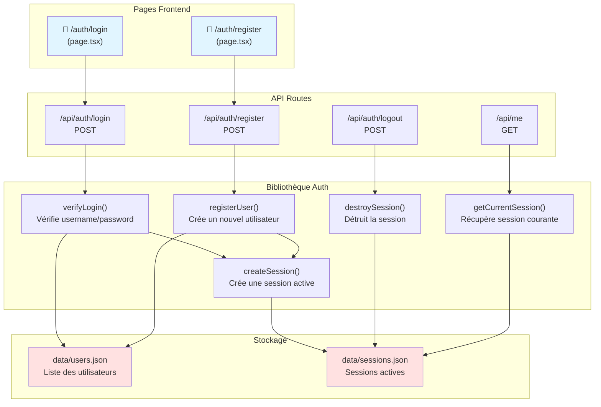
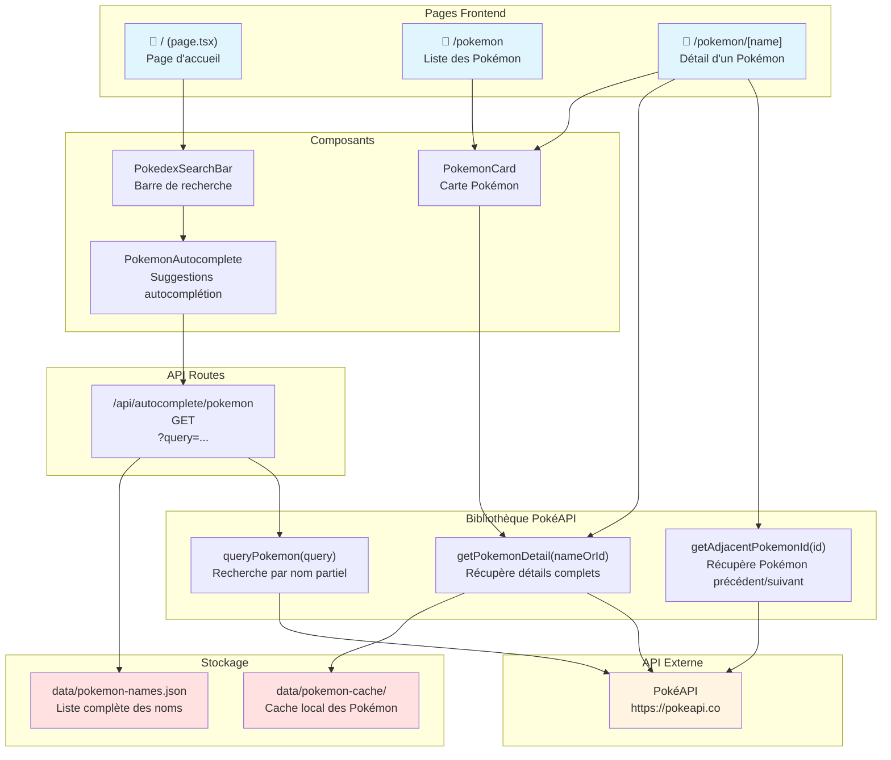
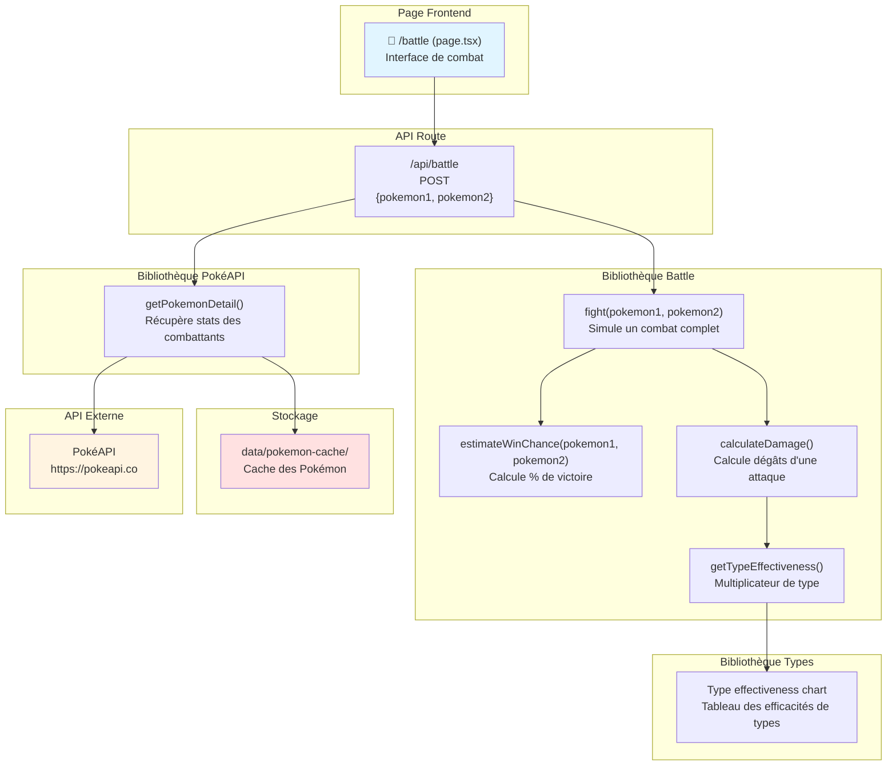
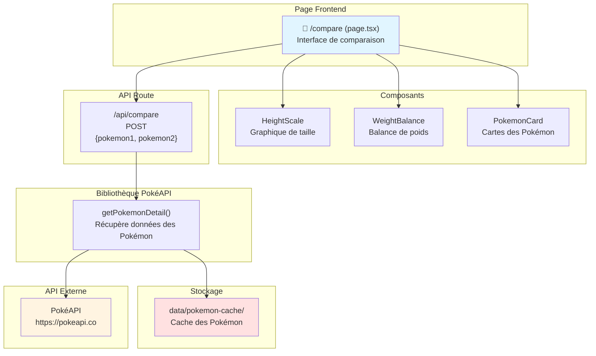
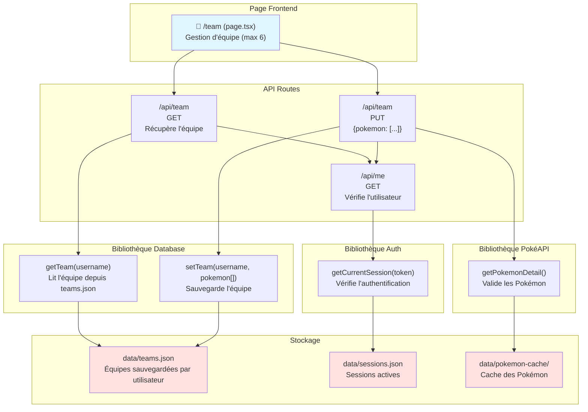
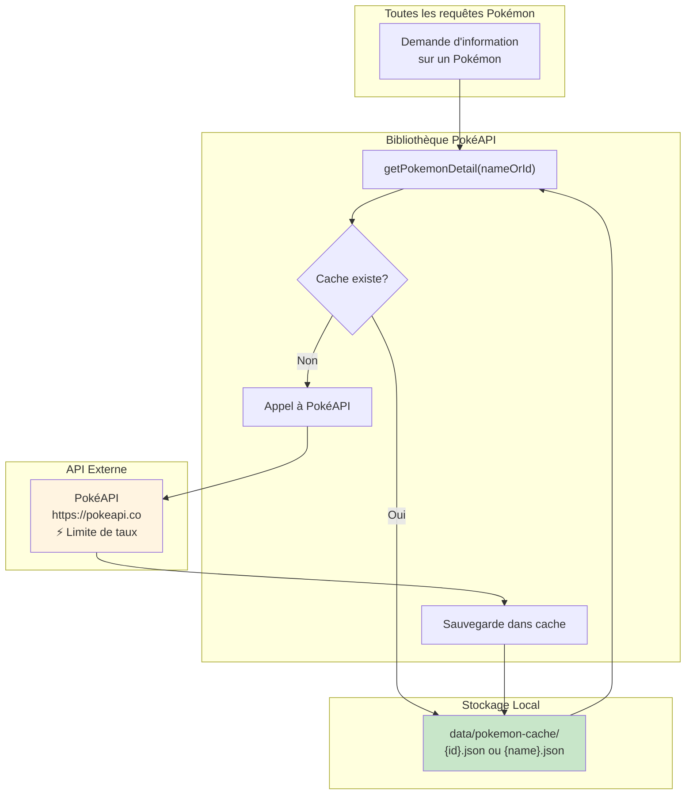
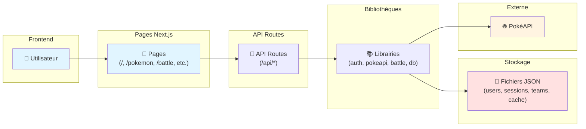

# pokedex-ai-v2
## Description
Pokedex AI is a web application that allows users to explore Pokémon data, including details about Pokémon, their evolutions, and more.

## Getting Started

### Prerequisites
- Node.js (version 14 or higher)
- npm (Node package manager)

### Installation
1. Clone the repository:
	```bash
	git clone https://github.com/Thibault-megard1/pokedex-ai-v2.git
	cd pokedex-ai-v2
	```
2. Install the dependencies:
	```bash
	npm install
	```

### Running the Application
To start the development server, run:
```bash
npm run dev
```

The application will be available at `http://localhost:3000`.

### Building for Production
To build the application for production, run:
```bash
npm run build
npm start
```

### Directory Structure
- **app/**: Contains the main application files, including pages and styles.
- **components/**: Contains reusable React components like `NavBar` and `PokemonCard`.
- **lib/**: Contains utility functions and API handling.
- **public/**: Contains static assets like images and backgrounds.

## Architecture de l'Application

### 1. 🔐 Système d'Authentification (Onglets: Login / Register)

Ce diagramme montre le flux d'authentification de l'application.



**Fonctions d'authentification:**
- **`verifyLogin(username, password)`**: Vérifie les identifiants dans `users.json` et retourne l'utilisateur si valide
- **`registerUser(username, password)`**: Ajoute un nouvel utilisateur dans `users.json` après vérification que le nom n'existe pas déjà
- **`createSession(username)`**: Génère un token de session unique et l'enregistre dans `sessions.json`
- **`destroySession(token)`**: Supprime la session de `sessions.json` (déconnexion)
- **`getCurrentSession(token)`**: Vérifie si le token existe dans `sessions.json` et retourne l'utilisateur associé

---

### 2. 🔍 Recherche de Pokémon (Onglets: Page principale / Pokemon)

Ce diagramme illustre la recherche et l'affichage des détails Pokémon.



**Fonctions de recherche Pokémon:**
- **`getPokemonDetail(nameOrId)`**: Récupère les détails complets d'un Pokémon (stats, types, sprites, évolutions). Utilise le cache local si disponible, sinon fait un appel à PokéAPI et met en cache
- **`queryPokemon(query)`**: Recherche des Pokémon dont le nom contient la chaîne `query`. Utilisé pour l'autocomplétion
- **`getAdjacentPokemonId(id)`**: Retourne les IDs des Pokémon précédent et suivant dans le Pokédex (navigation)

---

### 3. ⚔️ Système de Combat (Onglet: Battle)

Ce diagramme montre le fonctionnement du simulateur de combat.



**Fonctions de combat:**
- **`fight(pokemon1, pokemon2)`**: Simule un combat tour par tour entre deux Pokémon. Retourne le vainqueur, le nombre de tours, et un résumé des actions
- **`estimateWinChance(pokemon1, pokemon2)`**: Calcule statistiquement la probabilité de victoire du premier Pokémon basée sur les stats et types
- **`calculateDamage(attacker, defender, move)`**: Calcule les dégâts infligés selon la formule de Pokémon (Attack, Defense, Power, Type effectiveness)
- **`getTypeEffectiveness(attackType, defenderTypes)`**: Retourne le multiplicateur d'efficacité (0.5x, 1x, 2x, etc.) basé sur le tableau des types

---

### 4. 📊 Comparaison de Pokémon (Onglet: Compare)

Ce diagramme illustre la fonctionnalité de comparaison.



**Fonctions de comparaison:**
- La page `/compare` permet de comparer visuellement deux Pokémon côte à côte
- **`HeightScale`**: Composant qui affiche une échelle comparative des tailles (en mètres)
- **`WeightBalance`**: Composant qui affiche une balance comparative des poids (en kilogrammes)
- Les stats (HP, Attack, Defense, etc.) sont affichées dans des graphiques radar pour faciliter la comparaison

---

### 5. 👥 Gestion d'Équipe (Onglet: Team)

Ce diagramme montre la sauvegarde et récupération des équipes.



**Fonctions de gestion d'équipe:**
- **`getTeam(username)`**: Récupère l'équipe sauvegardée d'un utilisateur depuis `teams.json`. Retourne un tableau vide si aucune équipe n'existe
- **`setTeam(username, pokemon[])`**: Sauvegarde une équipe de Pokémon (max 6) pour un utilisateur dans `teams.json`
- L'API `/api/team` vérifie toujours l'authentification via `/api/me` avant d'autoriser la lecture/écriture
- Lors de la sauvegarde, chaque Pokémon est validé via `getPokemonDetail()` pour s'assurer qu'il existe

---

### 6. 🗂️ Système de Cache

Ce diagramme montre comment le cache optimise les performances.



**Système de cache:**
- Chaque Pokémon récupéré de PokéAPI est automatiquement sauvegardé dans `data/pokemon-cache/`
- Le nom du fichier correspond à l'ID ou au nom du Pokémon (ex: `25.json` ou `pikachu.json`)
- Lors d'une demande, le système vérifie d'abord le cache local avant d'appeler l'API externe
- **Avantages**: Réduit les appels API, améliore la vitesse de réponse, fonctionne hors ligne pour les Pokémon déjà consultés

---

## Flux de données complet



## Acknowledgments
- Thanks to the Pokémon API for providing the data.
- Inspired by various Pokémon applications and communities.