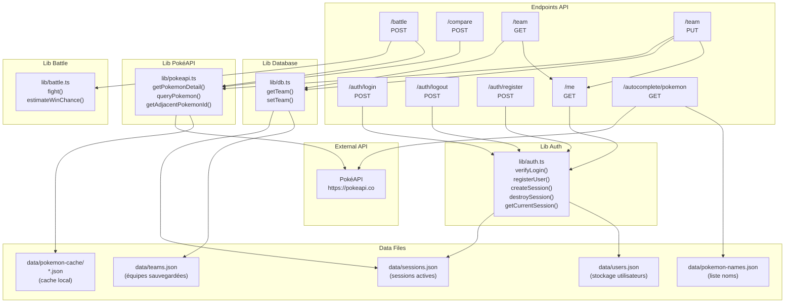

# pokedex-ai-v2
## Description
Pokedex AI is a web application that allows users to explore Pokémon data, including details about Pokémon, their evolutions, and more.

## Getting Started

### Prerequisites
- Node.js (version 14 or higher)
- npm (Node package manager)

### Installation
1. Clone the repository:
	```bash
	git clone https://github.com/Thibault-megard1/pokedex-ai-v2.git
	cd pokedex-ai-v2
	```
2. Install the dependencies:
	```bash
	npm install
	```

### Running the Application
To start the development server, run:
```bash
npm run dev
```

The application will be available at `http://localhost:3000`.

### Building for Production
To build the application for production, run:
```bash
npm run build
npm start
```

### Directory Structure
- **app/**: Contains the main application files, including pages and styles.
- **components/**: Contains reusable React components like `NavBar` and `PokemonCard`.
- **lib/**: Contains utility functions and API handling.
- **public/**: Contains static assets like images and backgrounds.

### Mermaid Diagram


## Acknowledgments
- Thanks to the Pokémon API for providing the data.
- Inspired by various Pokémon applications and communities.