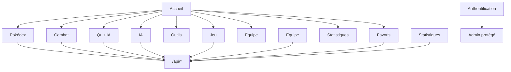

# Pokédex AI - Projet d'integration IA

## Description courte
Pokédex AI est une application web Next.js qui combine un Pokédex complet, des outils competitifs, un mode combat, un quiz de personnalite et des fonctionnalites IA (assistant, analyse de quiz, team builder).

## Contexte pedagogique
Ce projet sert de support au cours d'Intelligence Artificielle. Il illustre l'usage d'API REST, l'integration de LLM (local ou cloud), des sorties structurees JSON, et des compromis cout/latence/confidentialite.

## Technologies principales
- Next.js 14 (App Router), React 18, TypeScript
- Tailwind CSS
- Donnees PokéAPI + cache local JSON
- IA: Ollama (local) ou Mistral (cloud)
- PWA (service worker + manifest)

## Navigation globale (diagramme)
Ce schema situe les pages principales et leur passage par les routes API.


```mermaid
    graph TD
        Accueil[Accueil] --> Pokedex[Pokédex]
        Accueil --> Combat[Combat]
        Accueil --> Quiz[Quiz IA]
        Accueil --> Jeu[Jeu]
        Accueil --> Outils[Outils]
        Accueil --> IA[IA]
        Accueil --> Equipe[Équipe]
        Accueil --> Favoris[Favoris]
        Accueil --> Stats[Statistiques]
    
        Pokedex --> API["/api/*"]
        Combat --> API
        Quiz --> API
        IA --> API
        Jeu --> API
        Équipe --> API
        Favoris --> API
        Statistiques --> API
    
        Auth[Authentification] --> Admin[Admin protégé]

```

```mermaid
    graph TD
        Accueil[Accueil] --> Pokedex
        Accueil --> Equipe
        Accueil --> Combat
        Accueil --> Tournoi
        Accueil --> Calculateur
        Accueil --> Progression
        Accueil --> Favori
        Accueil --> Comparer
        Accueil --> Statistique
        Accueil --> Quizz
    
        Pokedex --> [Liste, Favori, Comparer]
        Combat --> API
        Quiz --> API
        IA --> API
        Jeu --> API
        Équipe --> API
        Favoris --> API
        Statistiques --> API
    
        Auth[Authentification] --> Admin[Admin protégé]

```

Le diagramme met en evidence la navigation centrale et le role transversal des endpoints `/api/*`.

## Installation
Prerequis: Node.js 18+ et npm.

```bash
npm install
```

## Lancer en local
```bash
npm run dev
```

Le site est accessible sur http://localhost:3000

## IA - Vue d'ensemble
- L'application peut fonctionner sans IA.
- Les fonctions IA sont utilisees pour l'assistant, le quiz et la construction d'equipe.
- Deux modes sont prevus: IA locale (Ollama) ou IA cloud (Mistral).

Voir la doc detaillee: [docs/ia.md](docs/ia.md)

## Changer de langue
- Un switcher de langue est disponible dans la navigation.
- La langue est stockee dans le navigateur (localStorage).

Voir: [docs/pokedex.md](docs/pokedex.md)

## Mode admin
- Le mode admin est reserve aux utilisateurs avec `isAdmin=true` dans `data/users.json`.
- L'espace admin permet de gerer les utilisateurs, le theme et l'analytics.

Voir: [docs/admin.md](docs/admin.md)

## Lien avec le cours d'Intelligence Artificielle
- **REST API**: PokéAPI et endpoints internes `/api/*`.
- **Prompt engineering**: prompts controles pour le quiz et l'assistant.
- **Sorties structurees**: reponses JSON valides attendues des LLM.
- **Local vs Cloud LLM**: Ollama (local) vs Mistral (cloud).
- **Compromis**: cout, latence, confidentialite, reproductibilite.
- **Valeur pedagogique**: mise en pratique d'un pipeline IA complet (collecte -> analyse -> restitution).

## Documentation
- [docs/pokedex.md](docs/pokedex.md)
- [docs/combat.md](docs/combat.md)
- [docs/quiz.md](docs/quiz.md)
- [docs/game.md](docs/game.md)
- [docs/admin.md](docs/admin.md)
- [docs/ia.md](docs/ia.md)
