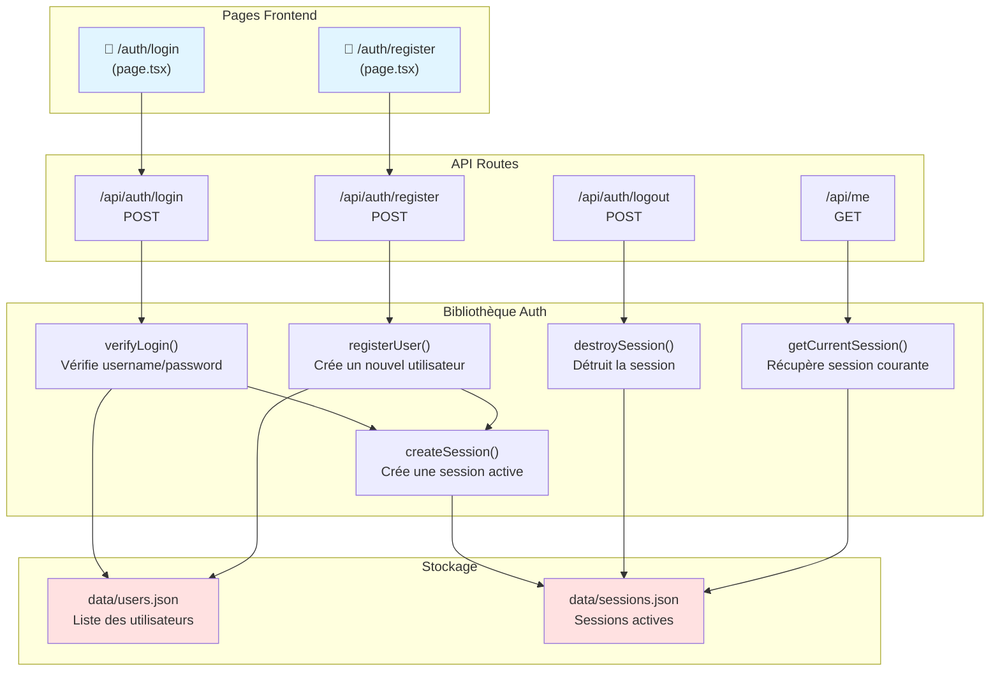
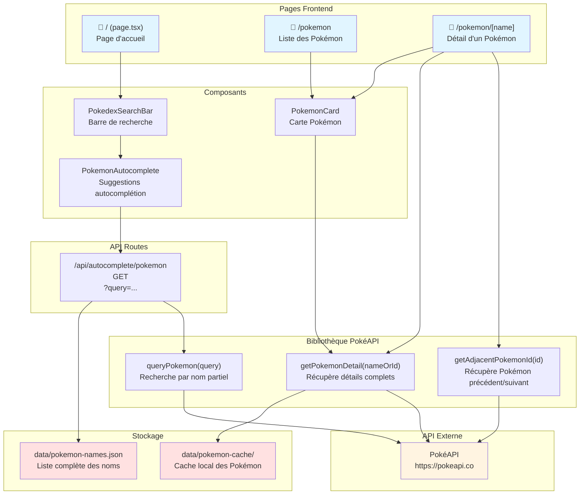
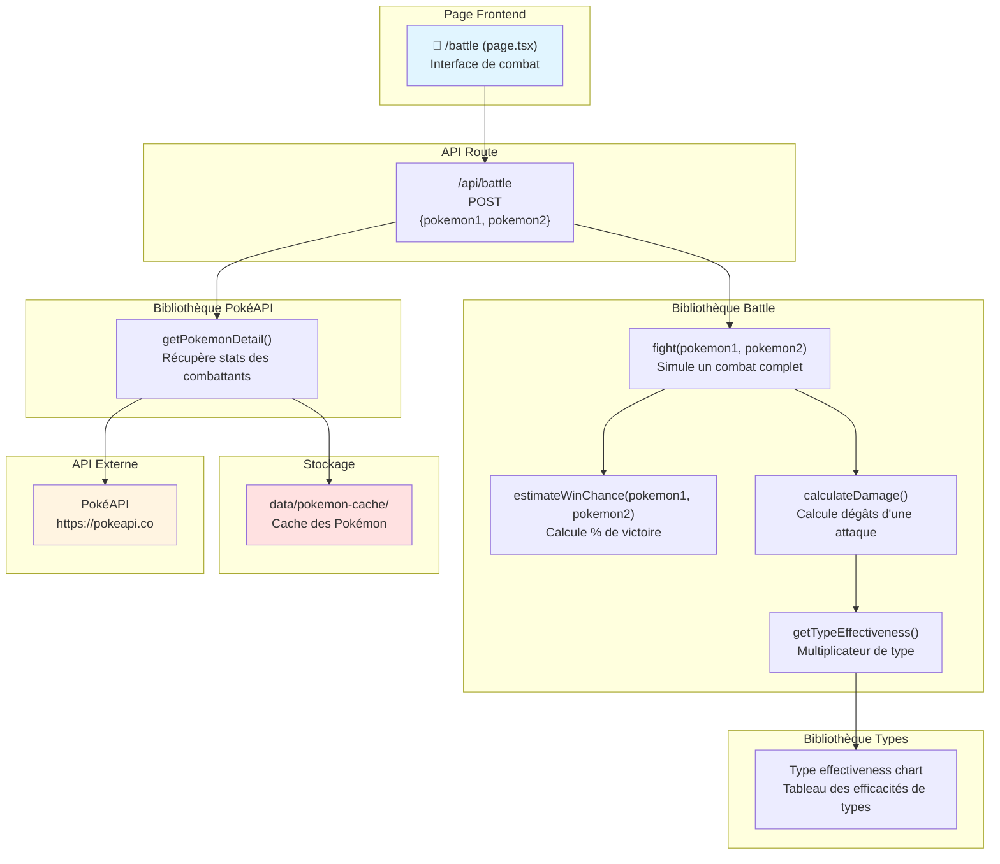
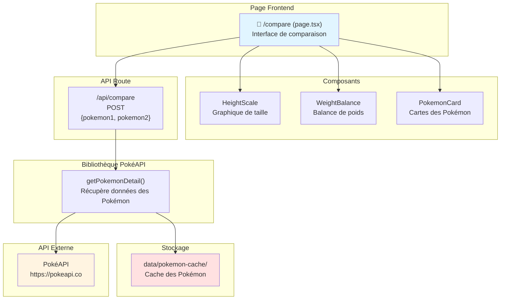
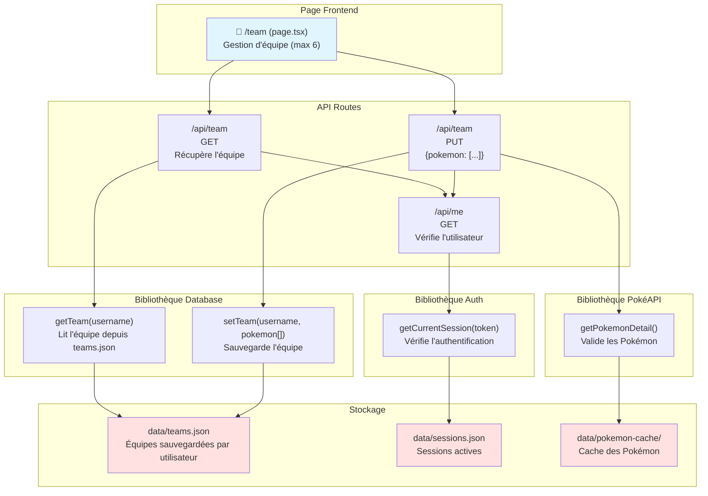
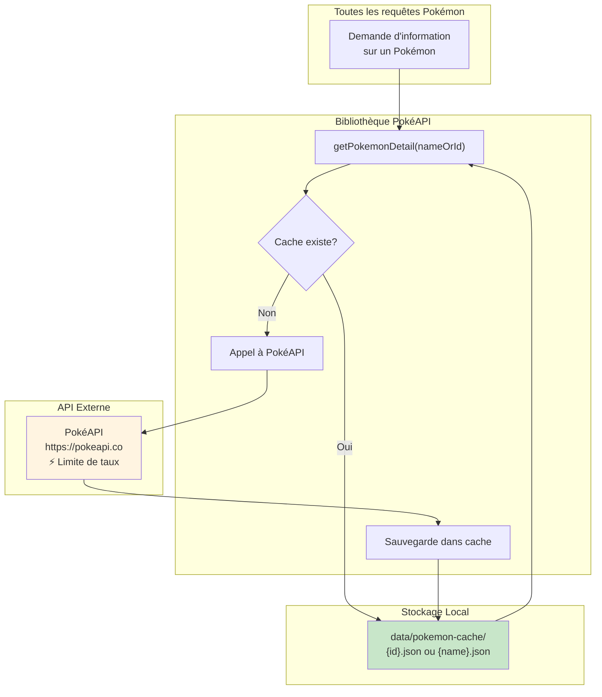
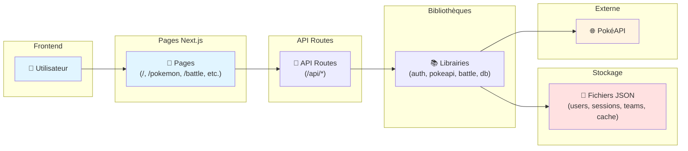

# Pokédex AI - Official Pokémon Web Application

A comprehensive Pokédex web application with AI-powered features, team building, battles, and more! Built with Next.js 14 and styled to match the official Pokémon aesthetic.

## ✨ Features

- 📖 **Complete Pokédex** - Browse all Pokémon with detailed stats, types, and evolutions
- 🤖 **AI-Powered Quiz** - Discover which Pokémon matches your personality
- 🧠 **Local AI (FREE)** - Use Ollama for unlimited AI features at no cost
- ⚔️ **Battle System** - 6v6 battles with evolution mechanics
- 👥 **Team Builder** - Create and manage your dream team with AI suggestions
- ⭐ **Favorites** - Save your favorite Pokémon
- 📊 **Stats & Analytics** - Track your Pokédex progress
- 🎮 **Trainer Authentication** - Personal accounts with local database
- 🏆 **Tournament Mode** - Advanced battle system with strategic evolution allocation

## 🚀 Quick Start

### Prerequisites
- Node.js (version 18 or higher)
- npm (Node package manager)
- **(Optional)** Ollama for FREE local AI features

### Installation

1. **Clone the repository:**
```bash
git clone https://github.com/Thibault-megard1/pokedex-ai-v2.git
cd pokedex-ai-v2
```

2. **Install dependencies:**
```bash
npm install
```

3. **Download UI assets:**
```bash
node scripts/download-assets.mjs
```

4. **Set up environment variables:**
```bash
# Copy the example file
cp .env.example .env.local

# Edit .env.local with your configuration
```

Example `.env.local` for **FREE local AI (Ollama)**:
```env
LLM_PROVIDER=ollama
OLLAMA_BASE_URL=http://localhost:11434
OLLAMA_MODEL=mistral
JWT_SECRET=your-super-secret-jwt-key
```

Example `.env.local` for **Mistral AI (paid)**:
```env
LLM_PROVIDER=mistral
MISTRAL_API_KEY=your_mistral_api_key_here
MISTRAL_MODEL=mistral-small-latest
JWT_SECRET=your-super-secret-jwt-key
```

5. **Start the development server:**
```bash
npm run dev
```

The application will be available at `http://localhost:3000`.

### Building for Production

```bash
npm run build
npm start
```

## 🧠 AI Configuration (Local LLM - FREE!)

This app supports **FREE local AI** using Ollama - no API keys required!

### Option 1: Ollama (FREE, recommended)

#### Windows Installation
1. Download Ollama from: https://ollama.ai
2. Run the installer
3. Open PowerShell/Terminal and verify:
```bash
ollama --version
```

#### Mac/Linux Installation
```bash
# Mac (Homebrew)
brew install ollama

# Linux
curl -fsSL https://ollama.ai/install.sh | sh
```

#### Download a Model
```bash
# Recommended: Mistral (fast, good French support)
ollama pull mistral

# Alternative: Llama 3 (better reasoning)
ollama pull llama3

# List installed models
ollama list
```

#### Verify Ollama is Running
```bash
# Check API endpoint
curl http://localhost:11434/api/tags

# Expected response: JSON with list of models
```

#### Configure the App
In your `.env.local`:
```env
LLM_PROVIDER=ollama
OLLAMA_BASE_URL=http://localhost:11434
OLLAMA_MODEL=mistral
```

That's it! The app now uses FREE local AI. No usage limits, no API costs.

### Option 2: Mistral AI (Paid)

If you prefer cloud AI:

1. Get an API key from: https://console.mistral.ai
2. Configure `.env.local`:
```env
LLM_PROVIDER=mistral
MISTRAL_API_KEY=your_api_key_here
MISTRAL_MODEL=mistral-small-latest
```

Pricing: ~€0.001-0.003 per 1K tokens (~0.15-0.25€ per 100 quiz analyses)

### Testing AI Status

Once configured, check AI status:
1. Start the dev server: `npm run dev`
2. Visit: http://localhost:3000/api/ai/health
3. Look for the AI status indicator in the navbar (green = online)

### Troubleshooting

**Ollama not connecting?**
```bash
# Check if Ollama is running
curl http://localhost:11434/api/tags

# Start Ollama (if not auto-started)
ollama serve

# Pull a model if missing
ollama pull mistral
```

**AI features not working?**
- Check the AI status indicator in the navbar
- Visit `/api/ai/health` to see detailed status
- The app works WITHOUT AI (quiz disabled gracefully)

## 🎨 UI Redesign

This application features a **complete Pokémon-themed UI redesign** inspired by official Game Freak Pokédex interfaces.

### Design Features
- ✅ **Press Start 2P** font for authentic Pokémon UI feel
- ✅ Pokédex-style red header with Pokéball logo
- ✅ 3D button effects with press animations
- ✅ Pokédex entry cards with hover effects
- ✅ Battle HP bars with color gradients
- ✅ Type-based color system (18 Pokémon types)
- ✅ Responsive design (mobile + desktop)
- ✅ Smooth animations and transitions
- ✅ AI status indicator in navbar

### Redesign Status
- ✅ Global CSS theme system
- ✅ Navigation bar with AI status
- ✅ Pokémon cards
- ⏳ Remaining pages (see `POKEDEX_REDESIGN_GUIDE.md` for details)

For complete redesign documentation, see: **[POKEDEX_REDESIGN_GUIDE.md](./POKEDEX_REDESIGN_GUIDE.md)**

## 📁 Project Structure

### Directory Structure
- **app/**: Contains the main application files, including pages and styles.
- **components/**: Contains reusable React components like `NavBar` and `PokemonCard`.
- **lib/**: Contains utility functions, API handling, and LLM providers.
  - **lib/llm/**: Unified LLM system (Ollama, Mistral, OpenAI)
- **public/**: Contains static assets like images and backgrounds.
- **data/**: Local database (users, teams, favorites, sessions)

## Architecture de l'Application

### 🧠 AI System (Multi-Provider)

The app uses a **unified LLM provider system** that supports multiple AI backends:

- **Ollama** (default): FREE local LLM, no API key required
- **Mistral**: Cloud API (paid)
- **OpenAI**: Coming soon

**Key files:**
- `lib/llm/index.ts` - Unified LLM interface
- `lib/llm/ollama.ts` - Ollama client (local, FREE)
- `lib/llm/mistral-client.ts` - Mistral API client
- `app/api/ai/health/route.ts` - AI health check endpoint
- `components/AIStatusIndicator.tsx` - Real-time AI status UI

**Features:**
- ✅ Automatic provider selection via env vars
- ✅ Graceful fallback if AI unavailable
- ✅ Rate limiting (5 quiz/min, 20 general/min)
- ✅ Health monitoring with ping times
- ✅ Structured JSON output validation
- ✅ French language support

### 1. 🔐 Système d'Authentification (Onglets: Login / Register)

Ce diagramme montre le flux d'authentification de l'application.


```mermaid
graph TB
    subgraph "Pages Frontend"
        LOGIN_PAGE["📄 /auth/login<br/>(page.tsx)"]
        REGISTER_PAGE["📄 /auth/register<br/>(page.tsx)"]
    end

    subgraph "API Routes"
        LOGIN_API["/api/auth/login<br/>POST"]
        REGISTER_API["/api/auth/register<br/>POST"]
        LOGOUT_API["/api/auth/logout<br/>POST"]
        ME_API["/api/me<br/>GET"]
    end

    subgraph "Bibliothèque Auth"
        VERIFY["verifyLogin()<br/>Vérifie username/password"]
        REGISTER_USER["registerUser()<br/>Crée un nouvel utilisateur"]
        CREATE_SESSION["createSession()<br/>Crée une session active"]
        DESTROY_SESSION["destroySession()<br/>Détruit la session"]
        GET_SESSION["getCurrentSession()<br/>Récupère session courante"]
    end

    subgraph "Stockage"
        USERS["data/users.json<br/>Liste des utilisateurs"]
        SESSIONS["data/sessions.json<br/>Sessions actives"]
    end

    LOGIN_PAGE --> LOGIN_API
    REGISTER_PAGE --> REGISTER_API
    
    LOGIN_API --> VERIFY
    REGISTER_API --> REGISTER_USER
    LOGOUT_API --> DESTROY_SESSION
    ME_API --> GET_SESSION
    
    VERIFY --> CREATE_SESSION
    REGISTER_USER --> CREATE_SESSION
    
    VERIFY --> USERS
    REGISTER_USER --> USERS
    CREATE_SESSION --> SESSIONS
    DESTROY_SESSION --> SESSIONS
    GET_SESSION --> SESSIONS
    
    style LOGIN_PAGE fill:#e1f5ff
    style REGISTER_PAGE fill:#e1f5ff
    style USERS fill:#ffe1e1
    style SESSIONS fill:#ffe1e1
```

**Fonctions d'authentification:**
- **`verifyLogin(username, password)`**: Vérifie les identifiants dans `users.json` et retourne l'utilisateur si valide
- **`registerUser(username, password)`**: Ajoute un nouvel utilisateur dans `users.json` après vérification que le nom n'existe pas déjà
- **`createSession(username)`**: Génère un token de session unique et l'enregistre dans `sessions.json`
- **`destroySession(token)`**: Supprime la session de `sessions.json` (déconnexion)
- **`getCurrentSession(token)`**: Vérifie si le token existe dans `sessions.json` et retourne l'utilisateur associé

---

### 2. 🔍 Recherche de Pokémon (Onglets: Page principale / Pokemon)

Ce diagramme illustre la recherche et l'affichage des détails Pokémon.


```mermaid
graph TB
    subgraph "Pages Frontend"
        HOME["📄 / (page.tsx)<br/>Page d'accueil"]
        POKEMON_PAGE["📄 /pokemon<br/>Liste des Pokémon"]
        POKEMON_DETAIL["📄 /pokemon/[name]<br/>Détail d'un Pokémon"]
    end

    subgraph "Composants"
        SEARCH_BAR["PokedexSearchBar<br/>Barre de recherche"]
        AUTOCOMPLETE["PokemonAutocomplete<br/>Suggestions autocomplétion"]
        POKEMON_CARD["PokemonCard<br/>Carte Pokémon"]
    end

    subgraph "API Routes"
        AUTOCOMPLETE_API["/api/autocomplete/pokemon<br/>GET<br/>?query=..."]
    end

    subgraph "Bibliothèque PokéAPI"
        GET_POKEMON["getPokemonDetail(nameOrId)<br/>Récupère détails complets"]
        QUERY_POKEMON["queryPokemon(query)<br/>Recherche par nom partiel"]
        GET_ADJACENT["getAdjacentPokemonId(id)<br/>Récupère Pokémon précédent/suivant"]
    end

    subgraph "Stockage"
        CACHE["data/pokemon-cache/<br/>Cache local des Pokémon"]
        NAMES["data/pokemon-names.json<br/>Liste complète des noms"]
    end

    subgraph "API Externe"
        POKEAPI["PokéAPI<br/>https://pokeapi.co"]
    end

    HOME --> SEARCH_BAR
    POKEMON_PAGE --> POKEMON_CARD
    POKEMON_DETAIL --> POKEMON_CARD
    
    SEARCH_BAR --> AUTOCOMPLETE
    AUTOCOMPLETE --> AUTOCOMPLETE_API
    
    AUTOCOMPLETE_API --> NAMES
    AUTOCOMPLETE_API --> QUERY_POKEMON
    
    POKEMON_DETAIL --> GET_POKEMON
    POKEMON_DETAIL --> GET_ADJACENT
    POKEMON_CARD --> GET_POKEMON
    
    GET_POKEMON --> CACHE
    GET_POKEMON --> POKEAPI
    QUERY_POKEMON --> POKEAPI
    GET_ADJACENT --> POKEAPI
    
    style HOME fill:#e1f5ff
    style POKEMON_PAGE fill:#e1f5ff
    style POKEMON_DETAIL fill:#e1f5ff
    style CACHE fill:#ffe1e1
    style NAMES fill:#ffe1e1
    style POKEAPI fill:#fff4e1
```

**Fonctions de recherche Pokémon:**
- **`getPokemonDetail(nameOrId)`**: Récupère les détails complets d'un Pokémon (stats, types, sprites, évolutions). Utilise le cache local si disponible, sinon fait un appel à PokéAPI et met en cache
- **`queryPokemon(query)`**: Recherche des Pokémon dont le nom contient la chaîne `query`. Utilisé pour l'autocomplétion
- **`getAdjacentPokemonId(id)`**: Retourne les IDs des Pokémon précédent et suivant dans le Pokédex (navigation)

---

### 3. ⚔️ Système de Combat (Onglet: Battle)

Ce diagramme montre le fonctionnement du simulateur de combat.


```mermaid
graph TB
    subgraph "Page Frontend"
        BATTLE_PAGE["📄 /battle (page.tsx)<br/>Interface de combat"]
    end

    subgraph "API Route"
        BATTLE_API["/api/battle<br/>POST<br/>{pokemon1, pokemon2}"]
    end

    subgraph "Bibliothèque Battle"
        FIGHT["fight(pokemon1, pokemon2)<br/>Simule un combat complet"]
        ESTIMATE["estimateWinChance(pokemon1, pokemon2)<br/>Calcule % de victoire"]
        CALCULATE_DAMAGE["calculateDamage()<br/>Calcule dégâts d'une attaque"]
        TYPE_EFFECTIVENESS["getTypeEffectiveness()<br/>Multiplicateur de type"]
    end

    subgraph "Bibliothèque PokéAPI"
        GET_POKEMON["getPokemonDetail()<br/>Récupère stats des combattants"]
    end

    subgraph "Bibliothèque Types"
        TYPE_CHART["Type effectiveness chart<br/>Tableau des efficacités de types"]
    end

    subgraph "Stockage"
        CACHE["data/pokemon-cache/<br/>Cache des Pokémon"]
    end

    subgraph "API Externe"
        POKEAPI["PokéAPI<br/>https://pokeapi.co"]
    end

    BATTLE_PAGE --> BATTLE_API
    
    BATTLE_API --> GET_POKEMON
    BATTLE_API --> FIGHT
    
    FIGHT --> ESTIMATE
    FIGHT --> CALCULATE_DAMAGE
    
    CALCULATE_DAMAGE --> TYPE_EFFECTIVENESS
    TYPE_EFFECTIVENESS --> TYPE_CHART
    
    GET_POKEMON --> CACHE
    GET_POKEMON --> POKEAPI
    
    style BATTLE_PAGE fill:#e1f5ff
    style CACHE fill:#ffe1e1
    style POKEAPI fill:#fff4e1
```

**Fonctions de combat:**
- **`fight(pokemon1, pokemon2)`**: Simule un combat tour par tour entre deux Pokémon. Retourne le vainqueur, le nombre de tours, et un résumé des actions
- **`estimateWinChance(pokemon1, pokemon2)`**: Calcule statistiquement la probabilité de victoire du premier Pokémon basée sur les stats et types
- **`calculateDamage(attacker, defender, move)`**: Calcule les dégâts infligés selon la formule de Pokémon (Attack, Defense, Power, Type effectiveness)
- **`getTypeEffectiveness(attackType, defenderTypes)`**: Retourne le multiplicateur d'efficacité (0.5x, 1x, 2x, etc.) basé sur le tableau des types

---

### 4. 📊 Comparaison de Pokémon (Onglet: Compare)

Ce diagramme illustre la fonctionnalité de comparaison.


```mermaid
graph TB
    subgraph "Page Frontend"
        COMPARE_PAGE["📄 /compare (page.tsx)<br/>Interface de comparaison"]
    end

    subgraph "Composants"
        HEIGHT_SCALE["HeightScale<br/>Graphique de taille"]
        WEIGHT_BALANCE["WeightBalance<br/>Balance de poids"]
        POKEMON_CARD["PokemonCard<br/>Cartes des Pokémon"]
    end

    subgraph "API Route"
        COMPARE_API["/api/compare<br/>POST<br/>{pokemon1, pokemon2}"]
    end

    subgraph "Bibliothèque PokéAPI"
        GET_POKEMON["getPokemonDetail()<br/>Récupère données des Pokémon"]
    end

    subgraph "Stockage"
        CACHE["data/pokemon-cache/<br/>Cache des Pokémon"]
    end

    subgraph "API Externe"
        POKEAPI["PokéAPI<br/>https://pokeapi.co"]
    end

    COMPARE_PAGE --> HEIGHT_SCALE
    COMPARE_PAGE --> WEIGHT_BALANCE
    COMPARE_PAGE --> POKEMON_CARD
    COMPARE_PAGE --> COMPARE_API
    
    COMPARE_API --> GET_POKEMON
    
    GET_POKEMON --> CACHE
    GET_POKEMON --> POKEAPI
    
    style COMPARE_PAGE fill:#e1f5ff
    style CACHE fill:#ffe1e1
    style POKEAPI fill:#fff4e1
```

**Fonctions de comparaison:**
- La page `/compare` permet de comparer visuellement deux Pokémon côte à côte
- **`HeightScale`**: Composant qui affiche une échelle comparative des tailles (en mètres)
- **`WeightBalance`**: Composant qui affiche une balance comparative des poids (en kilogrammes)
- Les stats (HP, Attack, Defense, etc.) sont affichées dans des graphiques radar pour faciliter la comparaison

---

### 5. 👥 Gestion d'Équipe (Onglet: Team)

Ce diagramme montre la sauvegarde et récupération des équipes.


```mermaid
graph TB
    subgraph "Page Frontend"
        TEAM_PAGE["📄 /team (page.tsx)<br/>Gestion d'équipe (max 6)"]
    end

    subgraph "API Routes"
        TEAM_GET_API["/api/team<br/>GET<br/>Récupère l'équipe"]
        TEAM_PUT_API["/api/team<br/>PUT<br/>{pokemon: [...]}"]
        ME_API["/api/me<br/>GET<br/>Vérifie l'utilisateur"]
    end

    subgraph "Bibliothèque Database"
        GET_TEAM["getTeam(username)<br/>Lit l'équipe depuis teams.json"]
        SET_TEAM["setTeam(username, pokemon[])<br/>Sauvegarde l'équipe"]
    end

    subgraph "Bibliothèque Auth"
        GET_SESSION["getCurrentSession(token)<br/>Vérifie l'authentification"]
    end

    subgraph "Bibliothèque PokéAPI"
        GET_POKEMON["getPokemonDetail()<br/>Valide les Pokémon"]
    end

    subgraph "Stockage"
        TEAMS["data/teams.json<br/>Équipes sauvegardées par utilisateur"]
        SESSIONS["data/sessions.json<br/>Sessions actives"]
        CACHE["data/pokemon-cache/<br/>Cache des Pokémon"]
    end

    TEAM_PAGE --> TEAM_GET_API
    TEAM_PAGE --> TEAM_PUT_API
    
    TEAM_GET_API --> ME_API
    TEAM_GET_API --> GET_TEAM
    
    TEAM_PUT_API --> ME_API
    TEAM_PUT_API --> GET_POKEMON
    TEAM_PUT_API --> SET_TEAM
    
    ME_API --> GET_SESSION
    
    GET_SESSION --> SESSIONS
    GET_TEAM --> TEAMS
    SET_TEAM --> TEAMS
    GET_POKEMON --> CACHE
    
    style TEAM_PAGE fill:#e1f5ff
    style TEAMS fill:#ffe1e1
    style SESSIONS fill:#ffe1e1
    style CACHE fill:#ffe1e1
```

**Fonctions de gestion d'équipe:**
- **`getTeam(username)`**: Récupère l'équipe sauvegardée d'un utilisateur depuis `teams.json`. Retourne un tableau vide si aucune équipe n'existe
- **`setTeam(username, pokemon[])`**: Sauvegarde une équipe de Pokémon (max 6) pour un utilisateur dans `teams.json`
- L'API `/api/team` vérifie toujours l'authentification via `/api/me` avant d'autoriser la lecture/écriture
- Lors de la sauvegarde, chaque Pokémon est validé via `getPokemonDetail()` pour s'assurer qu'il existe

---

### 6. 🗂️ Système de Cache

Ce diagramme montre comment le cache optimise les performances.


```mermaid
graph TB
    subgraph "Toutes les requêtes Pokémon"
        REQUEST["Demande d'information<br/>sur un Pokémon"]
    end

    subgraph "Bibliothèque PokéAPI"
        GET_POKEMON["getPokemonDetail(nameOrId)"]
        CHECK_CACHE{"Cache existe?"}
        FETCH_API["Appel à PokéAPI"]
        SAVE_CACHE["Sauvegarde dans cache"]
    end

    subgraph "Stockage Local"
        CACHE["data/pokemon-cache/<br/>{id}.json ou {name}.json"]
    end

    subgraph "API Externe"
        POKEAPI["PokéAPI<br/>https://pokeapi.co<br/>⚡ Limite de taux"]
    end

    REQUEST --> GET_POKEMON
    GET_POKEMON --> CHECK_CACHE
    
    CHECK_CACHE -->|Oui| CACHE
    CHECK_CACHE -->|Non| FETCH_API
    
    FETCH_API --> POKEAPI
    POKEAPI --> SAVE_CACHE
    SAVE_CACHE --> CACHE
    CACHE --> GET_POKEMON
    
    style CACHE fill:#c8e6c9
    style POKEAPI fill:#fff4e1
```

**Système de cache:**
- Chaque Pokémon récupéré de PokéAPI est automatiquement sauvegardé dans `data/pokemon-cache/`
- Le nom du fichier correspond à l'ID ou au nom du Pokémon (ex: `25.json` ou `pikachu.json`)
- Lors d'une demande, le système vérifie d'abord le cache local avant d'appeler l'API externe
- **Avantages**: Réduit les appels API, améliore la vitesse de réponse, fonctionne hors ligne pour les Pokémon déjà consultés

---

## Flux de données complet


```mermaid
graph LR
    subgraph "Frontend"
        USER["👤 Utilisateur"]
    end

    subgraph "Pages Next.js"
        PAGES["📄 Pages<br/>(/, /pokemon, /battle, etc.)"]
    end

    subgraph "API Routes"
        API["🔌 API Routes<br/>(/api/*)"]
    end

    subgraph "Bibliothèques"
        LIBS["📚 Librairies<br/>(auth, pokeapi, battle, db)"]
    end

    subgraph "Stockage"
        DATA["💾 Fichiers JSON<br/>(users, sessions, teams, cache)"]
    end

    subgraph "Externe"
        EXTERNAL["🌐 PokéAPI"]
    end

    USER --> PAGES
    PAGES --> API
    API --> LIBS
    LIBS --> DATA
    LIBS --> EXTERNAL
    
    style USER fill:#e1f5ff
    style PAGES fill:#e1f5ff
    style DATA fill:#ffe1e1
    style EXTERNAL fill:#fff4e1
```

## 📚 Documentation

Comprehensive documentation is available in the `/docs` folder:

- **[Getting Started](GETTING_STARTED.md)** - Quick installation and setup guide
- **[Features Overview](docs/FEATURES.md)** - Complete feature list
- **[Architecture Guide](docs/ARCHITECTURE.md)** - System architecture and design
- **[Game Guide](docs/GAME_GUIDE.md)** - Pokémon game implementation
- **[Battle System](docs/BATTLE_SYSTEM.md)** - Battle mechanics and systems
- **[Development Checklist](docs/DEV_CHECKLIST.md)** - Testing and verification guide

### AI Integration
- **[LLM Integration](docs/ai/llm-integration.md)** - Unified AI system documentation
- **[Ollama Setup](docs/ai/ollama-setup.md)** - Local AI installation guide

### Design & Features
- **[Redesign Guide](docs/design/redesign-guide.md)** - UI/UX design system
- **[Sprites Guide](docs/design/sprites-guide.md)** - Asset management
- **[Quiz Documentation](docs/features/quiz-documentation.md)** - Quiz feature details
- **[i18n Guide](docs/features/i18n-guide.md)** - Internationalization

### Utility Docs
- **[Git Commands](docs/git-commands.md)** - Common Git operations
- **[Documentation Index](docs/README.md)** - Full documentation index

## Acknowledgments
- Thanks to the Pokémon API for providing the data.
- Inspired by various Pokémon applications and communities.