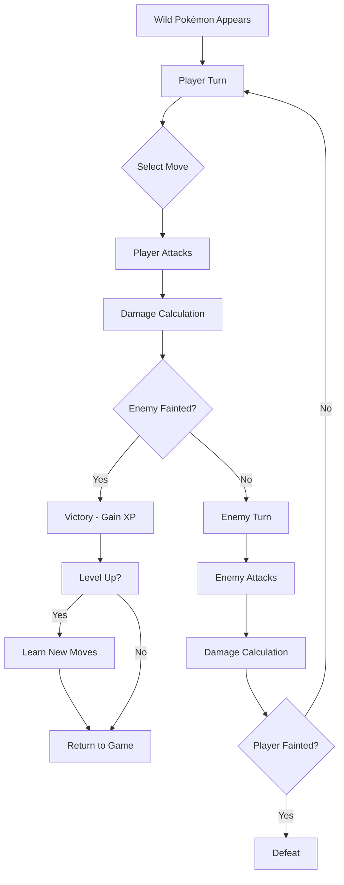

# ⚔️ Battle System Documentation

Complete guide to the Pokémon battle system, including Phaser game battles and team battle simulator.

## 📋 Table of Contents

1. [Overview](#overview)
2. [Phaser Game Battles](#phaser-game-battles)
3. [Team Battle Simulator](#team-battle-simulator)
4. [Battle Mechanics](#battle-mechanics)
5. [Visual System](#visual-system)
6. [Move System](#move-system)
7. [Status Effects](#status-effects)
8. [Sound Effects](#sound-effects)

---

## Overview

The application features TWO battle systems:

### 1. **Phaser Game Battles** (Wild Encounters)
- Real-time interactive battles in game mode
- Wild Pokémon encounters in tall grass
- Turn-based with player input
- Animations, sprites, sound effects
- Location: `lib/game/scenes/BattleScene.ts`

### 2. **Team Battle Simulator** (6v6)
- Strategic team battles at `/battle`
- AI opponent team generation
- Evolution allocation system
- Server-side calculation
- Location: `lib/battle/`

---

## Phaser Game Battles

### Starting a Battle

**In-Game:**
1. Navigate to http://localhost:3000/game
2. Walk through tall grass (dark green areas)
3. Random wild Pokémon encounter triggers

**For Testing:**
```typescript
// In GameScene.ts create() method:
this.time.delayedCall(1000, () => {
  this.scene.start('BattleScene', {
    enemyId: 25,      // Pikachu
    enemyLevel: 5
  });
});
```

### Battle Controls

```
Arrow Keys   Navigate moves
SPACE        Confirm selection
R            Run from battle
```

### Battle Flow



### Visual Layout

```
┌──────────────────────────────────────────────────────────┐
│              POKÉMON BATTLE SCENE                         │
│                                                            │
│  ╔═══════════════════╗                    🐭              │
│  ║ RATTATA      Lv7  ║                (Enemy Sprite)      │
│  ║ HP: ████████░░░   ║                   ◯ Shadow         │
│  ╚═══════════════════╝                                    │
│                                                            │
│          ◯ Shadow                    ╔══════════════════╗ │
│      (Player Sprite)                 ║ PIKACHU     Lv5  ║ │
│           ⚡                          ║ HP: ███████░░░   ║ │
│                                      ║     35 / 45       ║ │
│                                      ╚══════════════════╝ │
│                                                            │
│  ┌───────────────────────────────────────────────────┐   │
│  │ A wild RATTATA appeared!                          │   │
│  └───────────────────────────────────────────────────┘   │
│                                                            │
│    ╔═══════════╗              ╔═══════════╗              │
│    ║  Attack   ║              ║    Run    ║              │
│    ╚═══════════╝              ╚═══════════╝              │
└──────────────────────────────────────────────────────────┘
```

### Sprite Positions
```typescript
Enemy Sprite:  { x: width * 0.70, y: height * 0.30 }
Player Sprite: { x: width * 0.30, y: height * 0.65 }
Enemy HUD:     { x: width * 0.15, y: height * 0.15 }
Player HUD:    { x: width * 0.55, y: height * 0.75 }
```

### Animations

**Entrance:**
- Enemy slides in from right (600ms, back easing)
- Player bounces in with scale (500ms)
- HUDs fade in with stagger (300ms/500ms delay)

**Idle:**
- Both sprites bob up/down continuously
- Enemy: 1500ms cycle, 8px amplitude
- Player: 1600ms cycle, 8px amplitude
- Infinite loop with sine easing

**Attack:**
- Attacker moves forward 30px
- Screen shake (200ms, 0.01 intensity)
- Flash effect on target (red tint)
- Yoyo back to original position (150ms)
- Type-based sound effect plays

**HP Decrease:**
- Smooth 500ms tween animation
- HP bar color changes based on percentage:
  - Green (#10b981): HP > 50%
  - Yellow (#fbbf24): HP 25-50%
  - Red (#ef4444): HP < 25%

---

## Team Battle Simulator

### Accessing
Visit: **http://localhost:3000/battle**

### Features
- Build team of 6 Pokémon
- AI generates opponent team
- Allocate evolutions strategically
- Turn-based 6v6 battles
- Evolution during battle
- Full battle log

### Battle Rules

1. **Team Size**: 6 Pokémon per team
2. **Evolution System**: 
   - Each team gets evolution points
   - Allocate evolutions before battle
   - Pokémon can evolve mid-battle when conditions met
3. **Turn Order**: Based on Speed stat
4. **Type Effectiveness**: Full 18-type chart
5. **Victory**: First team to defeat all 6 opponent Pokémon wins

### Evolution Allocation
```typescript
// Example allocation
{
  pokemon1: 0,  // No evolution
  pokemon2: 1,  // Evolve to stage 1
  pokemon3: 2,  // Evolve to stage 2
  pokemon4: 1,  // Evolve to stage 1
  pokemon5: 0,  // No evolution
  pokemon6: 1   // Evolve to stage 1
}
```

---

## Battle Mechanics

### Damage Calculation

**Formula:**
```typescript
damage = Math.floor(
  (((2 * level / 5 + 2) * power * (attack / defense)) / 50 + 2) 
  * typeEffectiveness
)
```

**Factors:**
- **Level**: Pokémon level (1-100)
- **Power**: Move base power (10-150+)
- **Attack**: Attacker's Attack stat (adjusted by stat stages)
- **Defense**: Defender's Defense stat (adjusted by stat stages)
- **Type Effectiveness**: 0x, 0.25x, 0.5x, 1x, 2x, 4x

### Stat Stages

Stat stages range from -6 to +6 and multiply the stat:

```typescript
Multipliers = {
  -6: 0.25, -5: 0.28, -4: 0.33, -3: 0.40, -2: 0.50, -1: 0.66,
   0: 1.00,
  +1: 1.50, +2: 2.00, +3: 2.50, +4: 3.00, +5: 3.50, +6: 4.00
}
```

Moves like "Growl" reduce opponent's Attack stage.

### Type Effectiveness Chart

Full 18-type chart implemented:
- **Immune** (0x): Ghost vs. Normal/Fighting
- **Not Very Effective** (0.5x): Water vs. Water
- **Super Effective** (2x): Fire vs. Grass
- **Double Super** (4x): Ground vs. Electric/Rock

---

## Move System

### Move Sources
- Fetched from PokéAPI learnsets
- Based on Pokémon level
- Last 4 learned moves selected
- Fallback moves if API fails: Tackle, Growl

### Move Structure
```typescript
interface BattleMove {
  name: string;           // e.g., "Thunderbolt"
  type: string;           // e.g., "electric"
  power: number;          // 0-150+ (0 for status moves)
  pp: number;             // Power Points remaining
  maxPP: number;          // Maximum PP
  accuracy: number;       // 0-100 (100 = always hits)
  damageClass: string;    // "physical", "special", or "status"
  effect?: MoveEffect;    // Status/stat changes
}
```

### Move Effects

**Status Conditions:**
- Burn: 1/16 HP damage per turn, halves Attack
- Poison: 1/8 HP damage per turn
- Paralysis: 25% chance to skip turn, quarters Speed
- Sleep: Can't act for 1-3 turns
- Freeze: 20% chance to thaw each turn
- Confusion: 50% chance to hurt self

**Stat Changes:**
- Attack/Defense/Speed stages
- Lasts until Pokémon switches out
- Examples: Growl (-1 Attack), Agility (+2 Speed)

### Move Selection (Enemy AI)
```typescript
// Randomly select from available moves
const move = selectRandomMove(enemyMoves);
```

---

## Visual System

### Sprites

**Source:** PokeAPI Sprites Repository
```
Front: https://raw.githubusercontent.com/PokeAPI/sprites/master/sprites/pokemon/{id}.png
Back:  https://raw.githubusercontent.com/PokeAPI/sprites/master/sprites/pokemon/back/{id}.png
```

**Loading:**
- Preloaded for IDs 1-25 in BootScene
- Scaled 3x for visibility
- Fallback to colored rectangles if load fails

### HUD Boxes

**Enemy HUD (Top-Left):**
- Size: 200 × 70px
- Contents: Name, Level, HP bar
- No numerical HP (authentic to games)

**Player HUD (Bottom-Right):**
- Size: 240 × 80px
- Contents: Name, Level, HP bar, HP numbers
- Format: "35 / 45"

### Battle Background
Gradient background: Sky blue (#87CEEB) → Green (#90EE90)

### Responsive Design
- All positions percentage-based
- Resize handler updates on window resize
- Works on mobile and desktop

---

## Status Effects

### Implementation

**Status Display:**
- Badge appears next to Pokémon name
- Color-coded by status type
- Abbreviated: BRN, PSN, PAR, SLP, FRZ, CNF

**Turn Processing:**
```typescript
// Start of turn: Check if can act
const actionCheck = canPokemonAct(pokemon);
if (!actionCheck.canAct) {
  // Skip turn (paralysis, sleep, freeze)
}

// End of turn: Apply damage
if (pokemon.statusCondition === 'burn') {
  damage = Math.floor(pokemon.maxHp / 16);
  pokemon.hp -= damage;
}
```

### Status Duration
- Burn/Poison/Paralysis: Until end of battle
- Sleep: 1-3 turns
- Freeze: 20% thaw chance per turn
- Confusion: 1-4 turns

---

## Sound Effects

### Type-Based SFX

When any Pokémon attacks, plays sound based on move type.

**Audio Files:** `public/game/assets/sfx/types/`
- 18 type sounds: fire.wav, water.wav, electric.wav, etc.
- Fallback: neutral.wav

**Implementation:**
```typescript
// lib/game/audio/sfx.ts
playTypeSfx(moveType, volume);

// BattleScene.ts - Player attack
playTypeSfx(move.type, 0.6);

// BattleScene.ts - Enemy attack
playTypeSfx(move.type, 0.6);
```

**Caching:**
- Audio objects cached in Map
- No recreation on repeated use
- Resets `currentTime` for instant replay

### Pokémon Cries

```typescript
// Enemy Pokémon entrance
const cry = this.sound.add(`pokemon_cry_${enemyId}`, { volume: 0.3 });
cry.play();
```

**Source:** PokeAPI Cries Repository
```
https://raw.githubusercontent.com/PokeAPI/cries/main/cries/pokemon/latest/{id}.ogg
```

---

## Testing

### Test Wild Battle
```bash
npm run dev
# Navigate to http://localhost:3000/game
# Walk through tall grass
```

### Test Specific Pokémon
```typescript
// Modify GameScene.ts temporarily
this.scene.start('BattleScene', {
  enemyId: 25,    // Pikachu
  enemyLevel: 10
});
```

### Available Test IDs (1-25)
- 1: Bulbasaur
- 4: Charmander
- 7: Squirtle
- 25: Pikachu
- 19: Rattata
- 16: Pidgey
- 10: Caterpie

### Test Team Battle
```bash
# Navigate to http://localhost:3000/battle
# Build your team
# Click "Start Battle"
```

---

## File Reference

### Key Files

**Phaser Battle:**
- `lib/game/scenes/BattleScene.ts` - Main battle scene (1965 lines)
- `lib/game/moveSystem.ts` - Move management and damage
- `lib/game/levelingSystem.ts` - XP and leveling
- `lib/game/audio/sfx.ts` - Sound effects manager

**Team Battle:**
- `lib/battle/engine.ts` - Battle simulation
- `lib/battle/types.ts` - Type definitions
- `app/battle/page.tsx` - Battle UI

**Shared:**
- `lib/typeEffectiveness.ts` - Type chart
- `lib/pokeapi.ts` - API integration

---

## Performance Notes

- Sprites cached after first load
- Audio cached in Map (no recreation)
- Graphics objects reused (HP bars)
- Efficient tween system (GPU-accelerated)
- Limited sprite preload (IDs 1-25)

---

## Future Enhancements

- [ ] Held items
- [ ] Abilities
- [ ] Weather effects
- [ ] Terrain effects
- [ ] Multi-battles (Double/Triple)
- [ ] Mega Evolution
- [ ] Z-Moves
- [ ] Dynamax/Gigantamax

---

**For implementation details, see source code comments in battle files.** ⚔️
