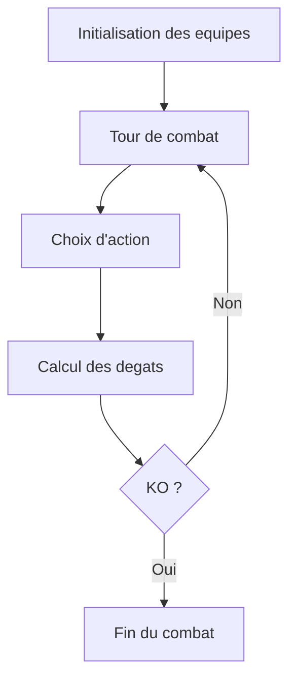

# Combat

## Objectif
Simuler des combats Pokemon et visualiser les tours, degats et vainqueurs.

## Fonctionnement
- UI: `app/battle/page.tsx`.
- Mecanique: `lib/battle/*` (moteur, degats, effets).
- API: `app/api/battle/route.ts` et `app/api/battle/team/route.ts`.

## IA
- Le module `lib/battle/ai.ts` implemente une logique d'aide a la decision.
- Cette IA est **rule-based** (pas de LLM). Elle choisit une action selon des regles deterministes.

## Boucle de combat (schema)
Ce schema resume le cycle tour par tour et le calcul des degats.

Le moteur applique des regles deterministes a chaque tour.

## Liens avec le cours IA
- **Agent-like behavior**: choix d'action base sur un etat.
- **Structured outputs**: l'API renvoie des tours structures.

## Limites
- Simulation deterministe et simplifiee par rapport aux jeux officiels.
- Ne modele pas toutes les capacites ou effets du metagame.
