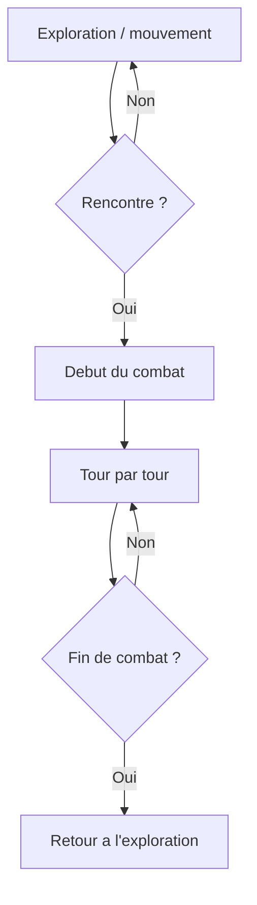

# Jeu

## Objectif
Proposer une experience ludique de type aventure avec scenes et sauvegarde.

## Fonctionnement
- UI: `app/game/page.tsx` et `components/game/GameCanvas.tsx`.
- Moteur: `lib/game/*` (scenes, sauvegarde, types, helpers).
- Sauvegarde: `app/api/game/save/route.ts` + JSON local.

## IA
Cette fonctionnalite n'utilise pas d'intelligence artificielle.

## Boucle de jeu (schema)
Ce schema montre la logique exploration -> rencontre -> combat.

La rencontre est declenchee par des zones de la carte ou des evenements.

## Liens avec le cours IA
- **REST API**: endpoints internes pour sauvegarde/chargement.
- **Architecture logicielle**: separation des scenes, etat et persistance.

## Limites
- Fonctionne en mode demo, pas de progression avancee.
- Dependance a Phaser et assets locaux.
