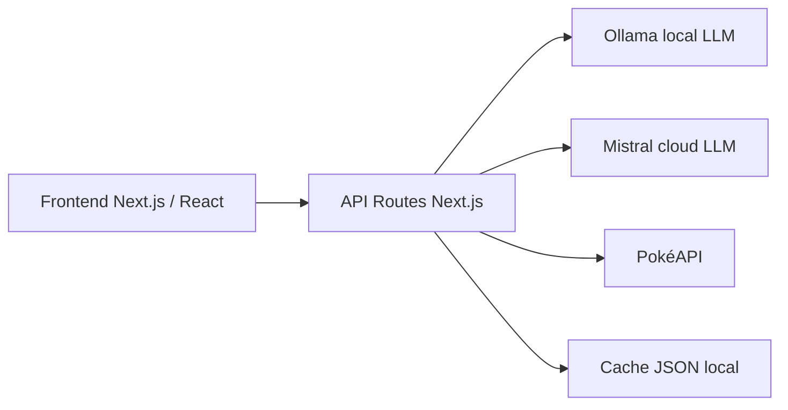
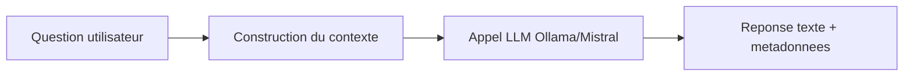
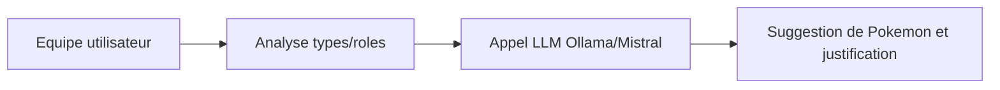
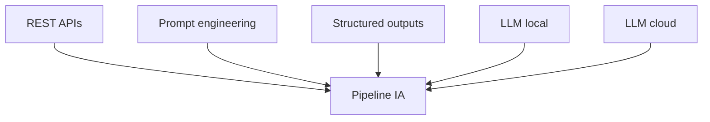

# IA (Intelligence Artificielle)

## Pourquoi utiliser l'IA ici
- Generer des analyses texte (quiz de personnalite).
- Fournir un assistant conversationnel pour l'exploration du Pokédex.
- Proposer des strategies et recommandations d'equipe.

## Approche choisie
- **LLM local (Ollama)**: pas de cout, meilleur controle des donnees.
- **LLM cloud (Mistral)**: meilleure qualite selon les cas, mais cout et latence.

## Donnees envoyees au modele
- Reponses utilisateur (quiz).
- Contexte Pokemon (noms, types, roles).
- Contraintes de format JSON pour fiabiliser l'integration.

## Sorties attendues
- JSON structure (resultats, alternatives, justifications).
- Reponses texte courtes pour l'assistant.

## Ou c'est implemente
- API IA: `app/api/ai/*`.
- Clients LLM: `lib/llm/*`.
- Orchestration: `lib/agents/*` et `lib/ai/*`.

## Architecture frontend / backend (schema)
Ce schema montre le chemin principal des requetes IA et des donnees.

Chaque fleche represente un appel (requete) et sa reponse (donnees ou inference).

## Local vs Cloud (comparatif)
- **Local (Ollama)**: gratuit, reproductible, donnees privees.
- **Cloud (Mistral)**: performances elevees, cout par token.

## Limites
- LLM probabiliste: resultats variables.
- Necessite de valider les sorties JSON.

## Flux IA - Assistant Pokédex
Ce flux illustre le cycle d'une question utilisateur vers une reponse contextualisee.

Le contexte integre l'historique et des connaissances Pokemon pour guider la reponse.

## Flux IA - Team Builder
Ce flux montre comment l'equipe actuelle est analysee puis completee par l'IA.

La sortie est structuree pour etre exploitable par l'UI.

## Lien avec le cours d'IA
- **REST API**: endpoints internes + PokéAPI.
- **Prompt engineering**: consignes explicites + format JSON.
- **Structured outputs**: contrats de reponse.
- **Agent-like behavior**: decomposition de taches (analyse, selection, justification).
- **Compromis**: cout, latence, confidentialite, reproductibilite.

## Alignement cours IA (schema)
Ce schema relie les concepts du cours aux elements concrets du projet.

On visualise comment chaque notion theorique s'incarne dans le code et les API.
