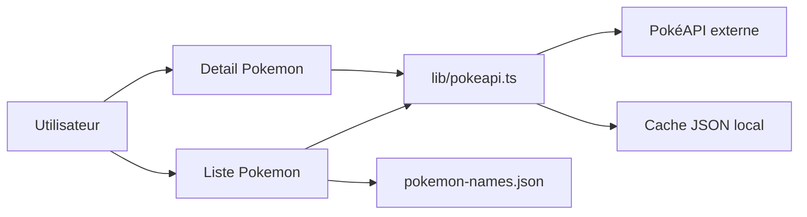

# Pokédex

## Objectif
Fournir un Pokédex complet: liste, recherche, details, evolutions et outils d'exploration.

## Fonctionnement
- Page liste: `app/pokemon/page.tsx`.
- Page detail: `app/pokemon/[name]/page.tsx`.
- Recuperation des donnees via `lib/pokeapi.ts` (cache local JSON).
- Autocomplete des noms via un JSON statique: `public/data/pokemon-names.json`.

## IA
Cette fonctionnalite n'utilise pas d'intelligence artificielle.

## Architecture Pokédex (schema)
Ce schema illustre le flux de donnees pour l'affichage et la recherche de Pokemon.

Les donnees sont recuperees via la PokéAPI puis mises en cache localement pour optimiser les performances.

## Liens avec le cours IA
- **REST API**: PokéAPI consommee cote serveur.
- **Structuration des donnees**: mapping des reponses en objets typés.

## Limites
- Depend de la disponibilite de la PokéAPI.
- Le cache local peut devenir stale sans revalidation.
