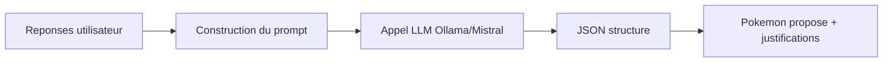

# Quiz IA

## Objectif
Associer un profil utilisateur a un Pokemon via un questionnaire.

## Fonctionnement
- UI: `app/quiz/page.tsx`.
- API d'analyse: `app/api/ai/quiz/route.ts`.
- Scoring et post-traitement: `lib/quiz.ts`, `lib/quizScoring.ts`.

## IA
- Utilise un LLM (Ollama local ou Mistral cloud) pour analyser des reponses textuelles.
- Donnees envoyees: reponses utilisateur, contexte du quiz, consignes de format JSON.
- Sortie attendue: un objet structure avec Pokemon principal, alternatives et justifications.

## Flux IA du quiz (schema)
Ce flux met en evidence l'enchainement entree -> traitement -> sortie.

Le prompt impose un format strict pour fiabiliser l'exploitation cote application.

## Liens avec le cours IA
- **Prompt engineering**: consignes explicites et format JSON impose.
- **Local vs Cloud**: Ollama (gratuit, local) vs Mistral (cloud, payant).
- **Reproductibilite**: meme prompt + meme modele => resultats proches.

## Limites
- Resultat probabiliste, peut varier selon le modele.
- Qualite dependante du prompt et du modele choisi.
