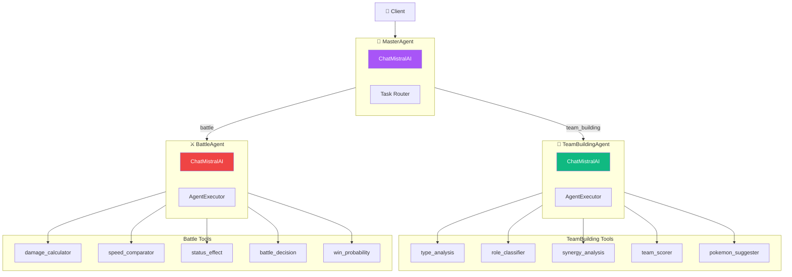

# 🤖 Architecture Multi-Agent LangChain

> Documentation complète de l'architecture multi-agent utilisant LangChain et Mistral AI

## 📋 Table des matières

- [🏗️ Vue d'ensemble](#vue-ensemble)
- [🔧 Tools avec @tool](#tools)
- [🤖 Agents LangChain](#agents)
- [📝 Exemples d'utilisation](#exemples)

---

## 🏗️ Vue d'ensemble {#vue-ensemble}

### Architecture LangChain



---

## 🔧 Tools avec @tool {#tools}

### Pattern LangChain Tool

Les tools sont définis avec la fonction `tool()` de `@langchain/core/tools` :

```typescript
import { tool } from "@langchain/core/tools";
import { z } from "zod";

// Définition d'un tool avec @tool
export const typeAnalysisTool = tool(
  async (input: { team: Pokemon[] }) => {
    const { team } = input;
    
    // Logique du tool
    const weaknesses = analyzeTeamWeaknesses(team);
    const resistances = analyzeTeamResistances(team);
    
    return JSON.stringify({
      weaknesses,
      resistances,
      score: calculateScore(weaknesses, resistances)
    });
  },
  {
    name: "type_analysis",
    description: "Analyse les types d'une équipe Pokémon",
    schema: z.object({
      team: z.array(PokemonSchema).describe("L'équipe à analyser")
    })
  }
);
```

### Liste des Tools

#### 🔧 TeamBuilding Tools

| Tool | Description | Input | Output |
|------|-------------|-------|--------|
| `type_analysis` | Analyse les types de l'équipe | `{ team: Pokemon[] }` | Faiblesses, résistances, couverture |
| `role_classifier` | Classifie les rôles | `{ team: Pokemon[] }` | Rôles par Pokémon, distribution |
| `synergy_analysis` | Analyse la synergie | `{ team: Pokemon[] }` | Score synergie, issues, forces |
| `team_scorer` | Score global | `{ team: Pokemon[] }` | Score 0-100, grade S-F |
| `pokemon_suggester` | Suggestions | `{ currentTeam, candidatePool }` | Top 5 suggestions avec scores |

#### ⚔️ Battle Tools

| Tool | Description | Input | Output |
|------|-------------|-------|--------|
| `damage_calculator` | Calcule les dégâts | `{ attacker, defender, move }` | Min/max damage, KO chance |
| `speed_comparator` | Compare les vitesses | `{ pokemon1, pokemon2 }` | Qui attaque en premier |
| `status_effect` | Évalue les statuts | `{ pokemon }` | Can move, damage/turn |
| `battle_decision` | Décision optimale | `{ myPokemon, opponent, team }` | Action, reasoning |
| `win_probability` | Probabilité victoire | `{ myTeam, opponentTeam }` | Win % (0-100) |

---

## 🤖 Agents LangChain {#agents}

### MasterAgent - Orchestrateur

```typescript
import { ChatMistralAI } from "@langchain/mistralai";
import { AgentExecutor, createToolCallingAgent } from "langchain/agents";

export class MasterAgent {
  private model: ChatMistralAI;
  private teamBuildingAgent: TeamBuildingAgent;
  private battleAgent: BattleAgent;

  constructor() {
    // Initialiser ChatMistralAI
    this.model = new ChatMistralAI({
      apiKey: process.env.MISTRAL_API_KEY,
      model: "mistral-large-latest",
      temperature: 0.1
    });

    // Initialiser les sub-agents
    this.teamBuildingAgent = new TeamBuildingAgent();
    this.battleAgent = new BattleAgent();
  }

  async process(request) {
    // Router vers le bon sub-agent
    if (request.task === "team_building") {
      return this.teamBuildingAgent.process(request);
    }
    if (request.task === "battle") {
      return this.battleAgent.process(request);
    }
  }
}
```

### TeamBuildingAgent - Expert Équipes

```typescript
import { ChatMistralAI } from "@langchain/mistralai";
import { AgentExecutor, createToolCallingAgent } from "langchain/agents";
import { teamBuildingTools } from "./teamBuildingTools";

export class TeamBuildingAgent {
  private model: ChatMistralAI;
  private agent: AgentExecutor;
  private tools = teamBuildingTools;

  async process(request: TeamBuildingRequest) {
    const prompt = ChatPromptTemplate.fromMessages([
      ["system", TEAM_BUILDING_SYSTEM_PROMPT],
      new MessagesPlaceholder("chat_history"),
      ["human", "{input}"],
      new MessagesPlaceholder("agent_scratchpad")
    ]);

    const agent = await createToolCallingAgent({
      llm: this.model,
      tools: this.tools,
      prompt
    });

    const executor = new AgentExecutor({
      agent,
      tools: this.tools,
      verbose: true
    });

    return await executor.invoke({ input: request });
  }
}
```

### BattleAgent - Expert Combat

```typescript
import { ChatMistralAI } from "@langchain/mistralai";
import { battleTools } from "./battleTools";

export class BattleAgent {
  private model: ChatMistralAI;
  private tools = battleTools;

  async process(request: BattleRequest) {
    // Même pattern que TeamBuildingAgent
    const agent = await createToolCallingAgent({
      llm: this.model,
      tools: this.tools,
      prompt: battlePrompt
    });

    return await executor.invoke({ input: request });
  }
}
```

---

## 📝 Exemples d'utilisation {#exemples}

### 1. Analyser une équipe

```typescript
import { MasterAgent } from '@/lib/agents/langchain';

const agent = new MasterAgent();

const result = await agent.process({
  task: 'team_building',
  teamBuildingRequest: {
    mode: 'analyze',
    currentTeam: [
      { id: 25, name: 'Pikachu', types: ['electric'] },
      { id: 7, name: 'Squirtle', types: ['water'] },
      { id: 1, name: 'Bulbasaur', types: ['grass', 'poison'] }
    ]
  }
});

console.log(result.teamBuildingResponse);
// {
//   success: true,
//   mode: 'analyze',
//   result: { weaknesses: [...], strengths: [...], grade: 'B' },
//   toolsUsed: ['type_analysis', 'role_classifier', 'synergy_analysis', 'team_scorer']
// }
```

### 2. Décision de combat

```typescript
const battleResult = await agent.process({
  task: 'battle',
  battleRequest: {
    state: {
      myTeam: [...],
      opponentTeam: [...],
      myActiveIndex: 0,
      opponentActiveIndex: 0,
      turn: 1
    },
    side: 'player',
    mode: 'single_decision'
  }
});

console.log(battleResult.battleResponse.decision);
// {
//   action: 'attack',
//   moveIndex: 0,
//   moveName: 'Thunderbolt',
//   reasoning: 'Super efficace x2, KO possible',
//   confidence: 'high'
// }
```

### 3. Appel direct aux tools

```typescript
import { typeAnalysisTool, damageCalculatorTool } from '@/lib/agents/langchain';

// Appel direct au tool
const typeResult = await typeAnalysisTool.invoke({
  team: myTeam
});

const damageResult = await damageCalculatorTool.invoke({
  attacker: myPokemon,
  defender: opponent,
  move: selectedMove
});
```

---

## 📦 Installation

```bash
# Installer les dépendances LangChain
pnpm add @langchain/core @langchain/mistralai langchain

# Variables d'environnement requises
MISTRAL_API_KEY=your_api_key
MISTRAL_MODEL=mistral-large-latest  # optionnel
```

---

## 🗂️ Structure des fichiers

```
lib/agents/langchain/
├── index.ts                 # Exports
├── MasterAgent.ts           # Orchestrateur
├── TeamBuildingAgent.ts     # Agent équipes
├── BattleAgent.ts           # Agent combat
├── teamBuildingTools.ts     # Tools équipes
└── battleTools.ts           # Tools combat
```

---

<div align="center">

**🔗 Voir aussi:**
[Architecture Complète](ok.md) • [Documentation Tools](tool.md)

</div>
