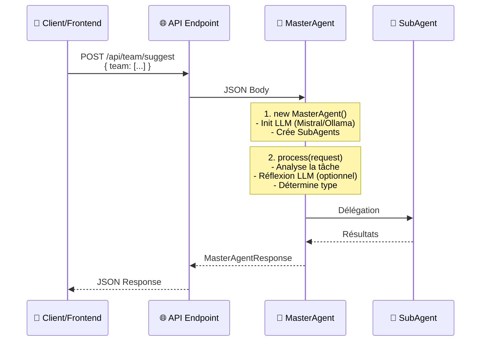
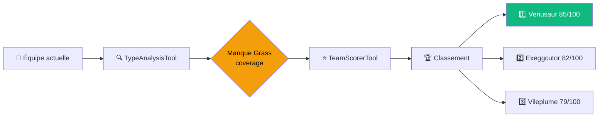
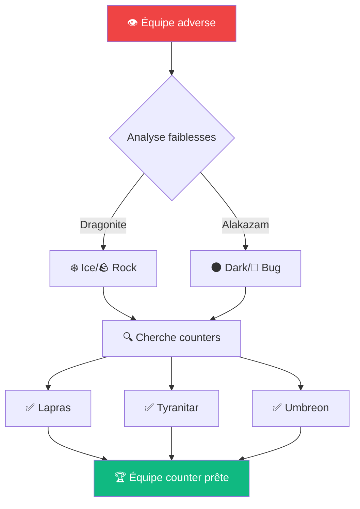
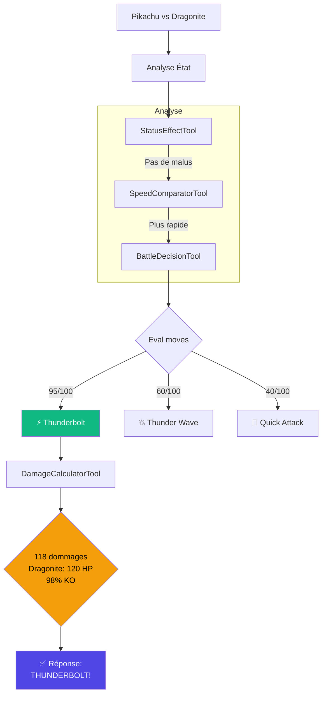
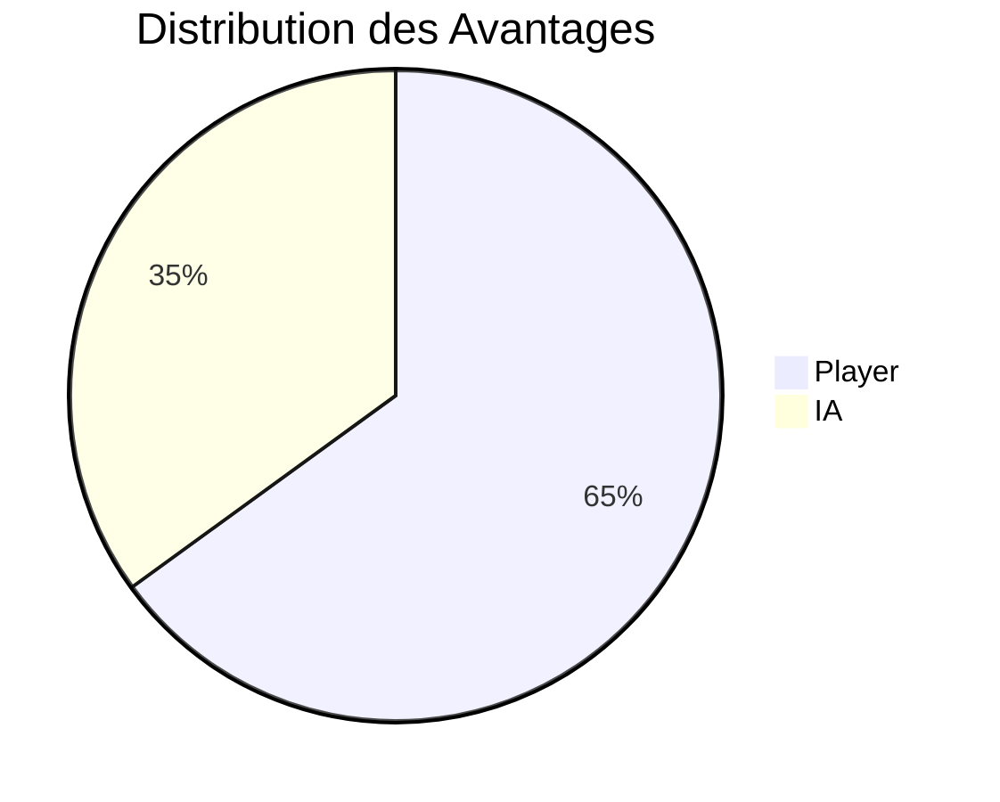
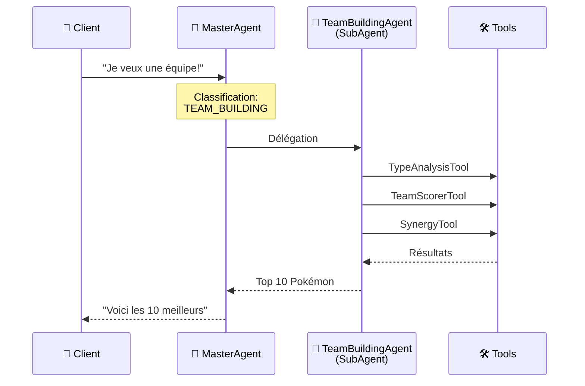
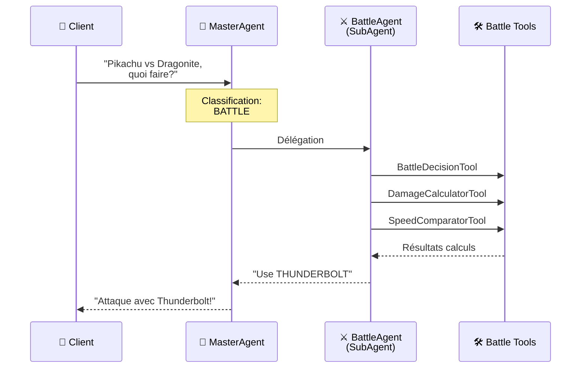

# 🤖 Architecture des Agents - Guide Complet

> Documentation complète sur l'architecture MasterAgent et SubAgents du Pokédex AI

## 📋 Table des matières

- [🎯 MasterAgent - L'Orchestrateur](#masteragent)
- [🔧 TeamBuildingAgent](#teambuilding-agent)
- [⚔️ BattleAgent](#battle-agent)
- [📊 Comparaison des Agents](#comparaison)

---

## 🎯 MasterAgent - L'Orchestrateur Principal {#masteragent}

<div align="center">


</div>

### 🎯 Rôle et Responsabilités

Le **MasterAgent** est le point d'entrée central qui :

| Responsabilité | Description |
|----------------|-------------|
| 🎭 **Classification** | Identifie le type de tâche demandée |
| 🔀 **Délégation** | Route vers le SubAgent approprié |
| 🧠 **Réflexion** | Utilise le LLM pour l'analyse complexe |
| 📊 **Agrégation** | Compile les résultats finaux |

### 🎭 Analogies pour Comprendre le MasterAgent

<table>
<tr>
<td width="33%">

#### 🍴 Le Restaurant

```
MasterAgent = Maître d'hôtel
```

**Scénario:**
1. 👤 Client: _"Je veux une bonne équipe Pokémon"_
2. 🤵 Maître: _"C'est du TEAM_BUILDING"_
3. 👨‍🍳 Appelle: _"Chef TeamBuilding!"_
4. ✅ Résultat: _"Équipe prête!"_

</td>
<td width="33%">

#### 🏥 L'Hôpital

```
MasterAgent = Infirmier d'accueil
```

**Scénario:**
1. 🤒 Patient: _"J'ai mal à la tête!"_
2. 👩‍⚕️ Infirmier: _"Cas pour le NEUROLOGUE"_
3. 👨‍⚕️ Envoi au service spécialisé
4. ✅ Diagnostic prêt

</td>
<td width="33%">

#### 🕵️ Le Détective

```
MasterAgent = Chef de police
```

**Scénario:**
1. 🚨 Vol de voiture signalé
2. 👮 Chef: _"Cas de CAMBRIOLAGE"_
3. 🔍 Inspecteur enquête
4. ✅ Coupable identifié

</td>
</tr>
</table>

### 💬 Comment ça marche ?



### 📦 Structure du MasterAgent

```typescript
class MasterAgent {
  private llmClient: LLMChatClient;        // Mistral ou Ollama
  private teamBuildingAgent: TeamBuildingAgent;
  private battleAgent: BattleAgent;
  
  async process(request: MasterAgentRequest): Promise<MasterAgentResponse> {
    // 1. Analyse de la requête
    // 2. Réflexion LLM (si activée)
    // 3. Délégation au SubAgent
    // 4. Retour de la réponse
  }
}
```

---

## 🔧 SubAgents - Les Spécialistes

### TeamBuildingAgent - Expert Construction d'Équipes {#teambuilding-agent}

<div align="center">


</div>

#### 🎯 Mission

Spécialiste de la construction d'équipes Pokémon avec 4 capacités principales :

| Mode | Description | Cas d'usage |
|------|-------------|-------------|
| 💡 **SUGGEST** | Suggère des Pokémon complémentaires | "À ajouter dans mon équipe ?" |
| 🔍 **ANALYZE** | Analyse une équipe complète | "Mon équipe est-elle équilibrée ?" |
| 🛡️ **COUNTER** | Crée un counter à une équipe adverse | "Comment battre cette équipe ?" |
| ✨ **GENERATE** | Génère une équipe complète | "Crée-moi une équipe !" |

#### 🎭 Analogie - Le Coach Sportif

> Tu vas au gym et dis: **"Je veux une bonne équipe musculaire"**
> 
> - 👨‍🏫 Coach: "Montre-moi tes muscles"
> - 📊 Analyse: "Tu es faible aux jambes"
> - 💡 Conseil: "3 exos de jambes pour équilibrer"
> - ✅ Résultat: Équipe d'exercices équilibrée !

---

### 📄 MODE 1 - SUGGEST (Suggestion)

**Contexte:** Tu as `[Pikachu, Squirtle]` et cherches un 3ème membre.



**Processus détaillé:**

1. 📊 **Analyse** des 2 Pokémon existants
2. 🔍 **TypeAnalysisTool** détecte: _"Manque Grass coverage"_
3. ⭐ **TeamScorerTool** évalue chaque candidat Grass
4. 🏆 **Classement** par score
5. ✅ **Réponse**: _"Venusaur est le meilleur choix"_

---

### 📄 MODE 2 - ANALYZE (Analyse Complète)

**Contexte:** Tu as une équipe de 6 Pokémon et demandes: _"C'est bon mon équipe ?"_

**Outils utilisés:**

| Outil | Fonction | Résultat |
|-------|----------|----------|
| 🎨 TypeAnalysisTool | Couverture de types | _"Couverture: 85%, Faiblesses: Ground, Rock"_ |
| 🎭 RoleClassifierTool | Classification des rôles | _"2 sweepers, 2 walls, 1 pivot, 1 support"_ |
| 🤝 SynergyTool | Synergie d'équipe | _"Mauvaise synergie: 2 electric"_ |
| ⭐ TeamScorerTool | Score global | _"Note: 72/100 → Grade: B"_ |

> **📋 Réponse finale:** _"Équipe correcte mais trop d'electrics, équilibre mieux les types"_

---

### 📄 MODE 3 - COUNTER (Counter l'Adversaire)

**Contexte:** Adversaire a `[Dragonite, Alakazam, ...]` - Comment le contrer ?



**Stratégie:**
1. 🎨 **TypeAnalysisTool** identifie les faiblesses de chaque ennemi
2. 🔍 **Recherche** de Pokémon avec super-effectiveness
3. 🛡️ **Sélection** de Pokémon résistants aux attaques adverses
4. ⭐ **Validation** avec TeamScorerTool

---

### 📄 MODE 4 - GENERATE (Génération Complète)

**Contexte:** _"Génère-moi une équipe de dragons légendaires!"_

<table>
<tr>
<td>

**📝 Étapes:**

1. 🔍 **Filtrage** du pool (type Dragon)
2. 🎭 **RoleClassifierTool** → Rôles variés
3. 🤝 **SynergyTool** → Synergie optimale
4. ⭐ **TeamScorerTool** → Validation finale

</td>
<td>

**🏆 Résultat:**

```json
{
  "team": [
    "Dragonite",    // Sweeper
    "Salamence",    // Sweeper
    "Garchomp",     // Physical
    "Dialga",       // Tank
    "Latios",       // Special
    "Altaria"       // Support
  ],
  "score": 88
}
```

</td>
</tr>
</table>

---

## ⚔️ BattleAgent - Expert Combat {#battle-agent}

<div align="center">


</div>

### 🎯 Mission

Spécialiste des décisions en combat temps réel :

| Capacité | Description |
|----------|-------------|
| 🎮 **Décision de Move** | Choisit l'attaque optimale |
| 🔄 **Switch Strategy** | Décide quand changer de Pokémon |
| 📊 **Win Probability** | Calcule les chances de victoire |
| 🤖 **Auto-Battle** | Simule combats complets 6v6 |

### 🎭 Analogie - Le Commentateur Sportif

> **Tour 1 du match de boxe:**
> 
> 🎤 Le commentateur analyse en direct :
> - 👊 _"Le champion A va attaquer à droite"_ (BattleDecisionTool)
> - 💥 _"Ça fera environ 80 dégâts"_ (DamageCalculatorTool)
> - ⚡ _"Le champion B sera plus rapide"_ (SpeedComparatorTool)
> - 😴 _"Attention, il est fatigué"_ (StatusEffectTool)
> - 📈 _"Probabilité de victoire: 65% pour A"_ (WinProbabilityTool)

---

### ⚙️ Méthode 1: executeTurn()

**Contexte:** `Pikachu vs Dragonite` au tour 3 - _"Qu'est-ce que je fais ?"_



**🎯 Décision finale:** _"Utilise **THUNDERBOLT** - Super efficace + peut KO!"_

---

### ⚙️ Méthode 2: autoBattle() - Simulation

**Contexte:** Simulation complète sans joueur humain

<table>
<tr>
<td width="50%">

**🔄 Procédure:**

```typescript
while (teamA.alive > 0 && teamB.alive > 0) {
  // Tour N
  executeTurn(teamA, teamB);
  
  if (pokemon.hp <= 0) {
    autoSwitch();
  }
  
  turn++;
}

return winner;
```

</td>
<td width="50%">

**🏆 Résultats possibles:**

- ✅ _"Joueur gagne en 6 tours!"_
- ❌ _"IA gagne en 8 tours!"_
- 🤝 _"Match nul après 100 tours"_

**📊 Statistiques:**
- Dommages totaux
- Kills par Pokémon
- MVP du match

</td>
</tr>
</table>

---

### ⚙️ Méthode 3: analyzeCurrentState()

**Contexte:** _"Analyse la situation actuelle"_



**📊 Analyse détaillée:**

| Critère | Valeur | Impact |
|---------|--------|--------|
| 🏆 **Avantage** | PLAYER | 65% |
| 🔥 **Momentum** | PLAYER | Initiative |
| 💪 **Buffs** | +1 Attack | Positif |
| ⚠️ **Risques** | Faible Ground | Critique |
| 🎯 **Matchup** | Favorable | Très bon |

> **💡 Recommandations:**
> - 💥 Attaque agressivement
> - ⚠️ Attention au Ground move
> - ✅ Tu peux potentiellement KO

---

## 📊 Comparaison MasterAgent vs SubAgents {#comparaison}

<div align="center">

### Tableau Comparatif

</div>

| Critère | 🤖 MasterAgent | 🔧 SubAgents |
|---------|------------------|-------------|
| **Rôle** | 🎭 Orchestrateur | 💼 Spécialiste |
| **Niveau** | 📊 Haut niveau | 🔧 Détails techniques |
| **Décisions** | "❓ Quel SubAgent?" | "🛠️ Comment faire?" |
| **LLM** | ✅ Oui (réflexion) | ❌ Non (exécution) |
| **Nombre** | 1️⃣ Un seul | 2️⃣+ Plusieurs |
| **Fichier** | `MasterAgent.ts` | `subAgents/*.ts` |
| **Outils** | ❌ Aucun | ✅ TeamBuilding/Battle Tools |

---

### 🔄 Flux Complet - Exemple 1



---

### ⚔️ Flux Complet - Exemple 2



---

## 🎓 Conclusion

<div align="center">

**L'architecture multi-agent permet:**

🧩 **Modularité** • 🎯 **Spécialisation** • 🔄 **Scalabilité** • 🧑‍💻 **Maintenabilité**

</div>

> Le **MasterAgent** orchestre intelligemment les **SubAgents** spécialisés,
> qui utilisent des **Tools** précis pour accomplir des tâches complexes
> de manière efficace et maintenable.

---

<div align="center">

🔗 **Voir aussi:**
[Architecture Complète](ok.md) • [Documentation Tools](tool.md) • [Multi-Agent Diagram](multi-agent-architecture.md)

</div>
