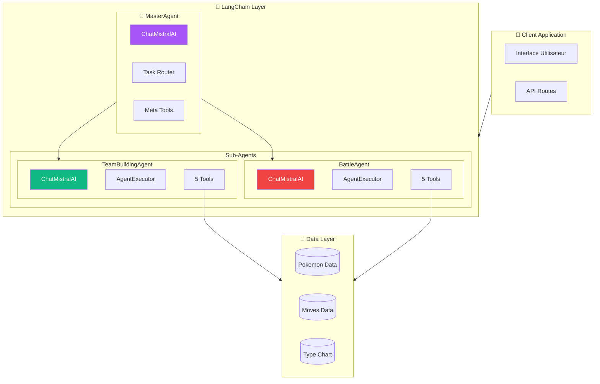
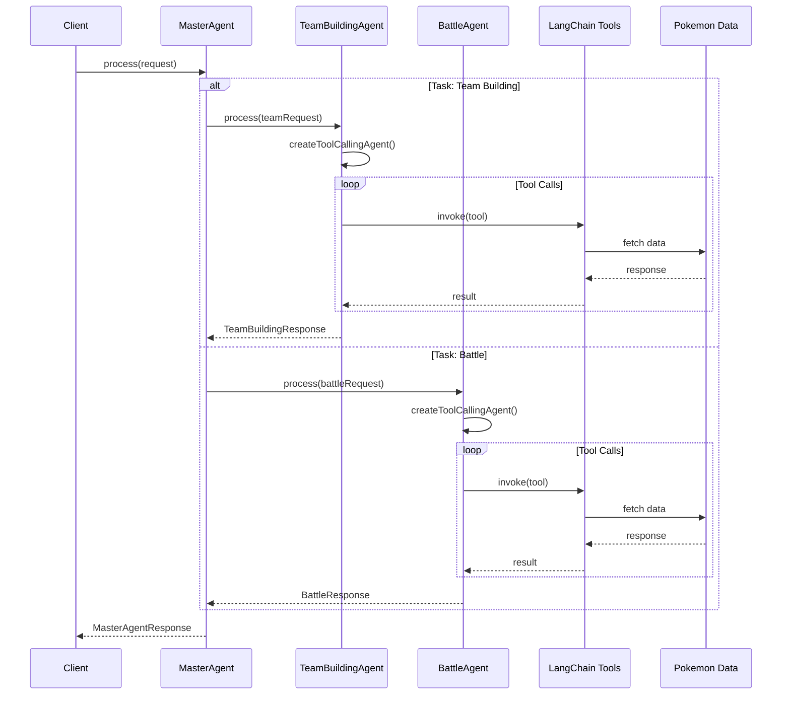
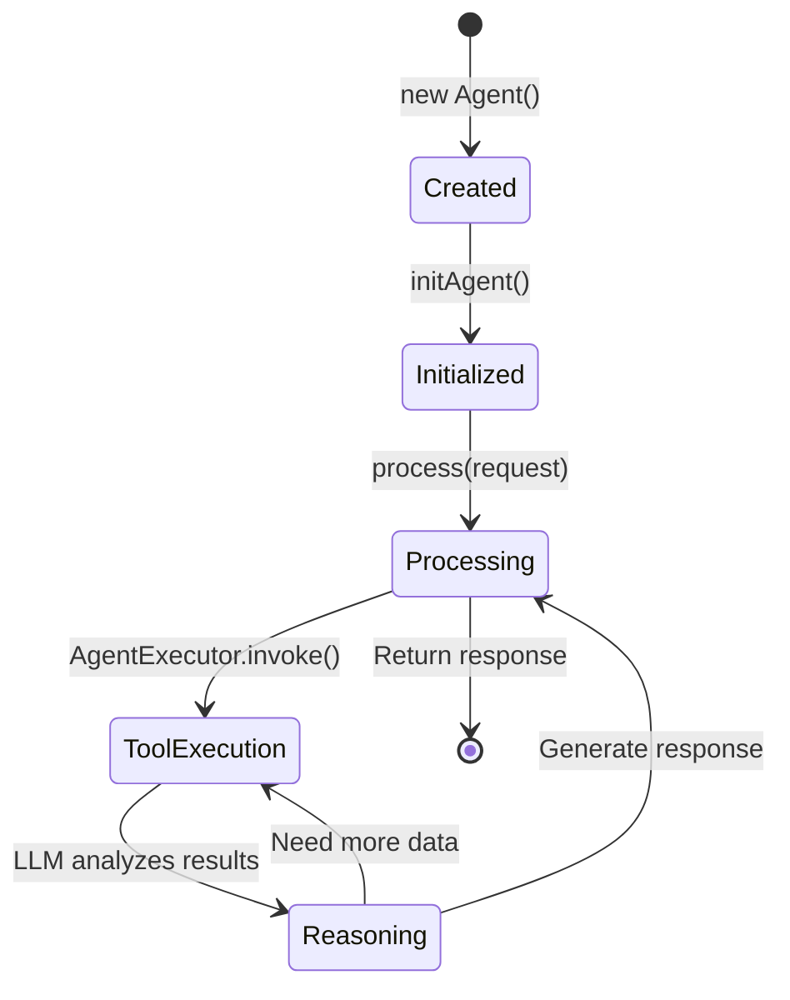

# 🏗️ Architecture Complète LangChain

> Documentation détaillée de l'architecture multi-agent avec LangChain et Mistral AI

## 📋 Table des matières

- [🎯 Vue globale](#vue-globale)
- [🔄 Flux de données](#flux-donnees)
- [⚙️ Configuration](#configuration)
- [📊 Types TypeScript](#types)

---

## 🎯 Vue globale {#vue-globale}

### Diagramme d'architecture



### Stack Technologique

| Composant | Technologie | Version |
|-----------|-------------|---------|
| Framework | Next.js | 14.x |
| LangChain Core | @langchain/core | ^0.3.0 |
| LangChain Mistral | @langchain/mistralai | ^0.1.0 |
| LangChain | langchain | ^0.3.0 |
| Validation | Zod | ^3.22 |
| Runtime | Node.js | 18+ |

---

## 🔄 Flux de données {#flux-donnees}

### Séquence de requête



### Cycle de vie d'un Agent



---

## ⚙️ Configuration {#configuration}

### Variables d'environnement

```env
# Mistral AI Configuration
MISTRAL_API_KEY=your_mistral_api_key
MISTRAL_MODEL=mistral-large-latest

# Agent Configuration (optionnel)
AGENT_VERBOSE=true
AGENT_TEMPERATURE=0.1
AGENT_MAX_ITERATIONS=10
```

### Configuration des Agents

```typescript
// Configuration par défaut
const DEFAULT_CONFIG = {
  model: 'mistral-large-latest',
  temperature: 0.1,
  maxIterations: 10,
  verbose: process.env.NODE_ENV === 'development'
};

// Initialisation ChatMistralAI
const model = new ChatMistralAI({
  apiKey: process.env.MISTRAL_API_KEY,
  model: process.env.MISTRAL_MODEL || DEFAULT_CONFIG.model,
  temperature: DEFAULT_CONFIG.temperature
});

// Configuration AgentExecutor
const executor = new AgentExecutor({
  agent,
  tools,
  verbose: DEFAULT_CONFIG.verbose,
  maxIterations: DEFAULT_CONFIG.maxIterations,
  returnIntermediateSteps: true
});
```

---

## 📊 Types TypeScript {#types}

### Interfaces principales

```typescript
// ===== Request Types =====

interface MasterAgentRequest {
  task: 'team_building' | 'battle' | 'auto';
  teamBuildingRequest?: TeamBuildingRequest;
  battleRequest?: BattleRequest;
  query?: string;
}

interface TeamBuildingRequest {
  mode: 'suggest' | 'analyze' | 'counter' | 'generate';
  currentTeam?: SimplePokemon[];
  targetTeam?: SimplePokemon[];
  candidatePool?: SimplePokemon[];
  strategy?: string;
}

interface BattleRequest {
  state: BattleState;
  side: 'player' | 'opponent';
  mode: 'single_decision' | 'analyze' | 'full_battle';
}

// ===== Response Types =====

interface MasterAgentResponse {
  success: boolean;
  task: 'team_building' | 'battle';
  teamBuildingResponse?: TeamBuildingResponse;
  battleResponse?: BattleResponse;
  error?: string;
  executionTime: number;
}

interface TeamBuildingResponse {
  success: boolean;
  mode: string;
  result: any;
  toolsUsed: string[];
  reasoning: string;
}

interface BattleResponse {
  success: boolean;
  decision: BattleDecision;
  winProbability: number;
  toolsUsed: string[];
  reasoning: string;
}

// ===== Domain Types =====

interface SimplePokemon {
  id: number;
  name: string;
  types: string[];
  stats?: Stats;
  moves?: Move[];
  ability?: string;
  item?: string;
  nature?: string;
}

interface BattleState {
  myTeam: BattlePokemon[];
  opponentTeam: BattlePokemon[];
  myActiveIndex: number;
  opponentActiveIndex: number;
  turn: number;
  weather?: string;
  terrain?: string;
}

interface BattleDecision {
  action: 'attack' | 'switch';
  moveIndex?: number;
  moveName?: string;
  switchToIndex?: number;
  switchToName?: string;
  reasoning: string;
  confidence: 'high' | 'medium' | 'low';
}
```

### Schémas Zod pour Tools

```typescript
import { z } from 'zod';

// Schéma Pokémon simplifié
const SimplePokemonSchema = z.object({
  id: z.number().describe("Numéro du Pokémon"),
  name: z.string().describe("Nom du Pokémon"),
  types: z.array(z.string()).describe("Types du Pokémon")
});

// Schéma pour type_analysis
const TypeAnalysisSchema = z.object({
  team: z.array(SimplePokemonSchema)
    .max(6)
    .describe("Équipe à analyser (max 6)")
});

// Schéma pour damage_calculator
const DamageCalculatorSchema = z.object({
  attacker: z.object({
    name: z.string(),
    types: z.array(z.string()),
    stats: z.object({ attack: z.number(), specialAttack: z.number() }),
    level: z.number().default(50)
  }),
  defender: z.object({
    name: z.string(),
    types: z.array(z.string()),
    stats: z.object({ defense: z.number(), specialDefense: z.number(), hp: z.number() })
  }),
  move: z.object({
    name: z.string(),
    type: z.string(),
    power: z.number(),
    category: z.enum(['physical', 'special']),
    accuracy: z.number().optional()
  })
});
```

---

## 🔌 Intégration API

### Route API Next.js

```typescript
// app/api/agents/route.ts
import { NextRequest, NextResponse } from 'next/server';
import { MasterAgent } from '@/lib/agents/langchain';

const agent = new MasterAgent();

export async function POST(request: NextRequest) {
  try {
    const body = await request.json();
    
    const result = await agent.process({
      task: body.task,
      teamBuildingRequest: body.teamBuilding,
      battleRequest: body.battle,
      query: body.query
    });
    
    return NextResponse.json(result);
  } catch (error) {
    return NextResponse.json(
      { success: false, error: error.message },
      { status: 500 }
    );
  }
}
```

### Appel depuis le client

```typescript
// Exemple d'appel API
async function analyzeTeam(team: SimplePokemon[]) {
  const response = await fetch('/api/agents', {
    method: 'POST',
    headers: { 'Content-Type': 'application/json' },
    body: JSON.stringify({
      task: 'team_building',
      teamBuilding: {
        mode: 'analyze',
        currentTeam: team
      }
    })
  });
  
  return await response.json();
}
```

---

## 🛡️ Gestion des erreurs

```typescript
// Wrapper avec retry et fallback
async function safeAgentCall<T>(
  fn: () => Promise<T>,
  retries = 3
): Promise<T> {
  let lastError: Error;
  
  for (let i = 0; i < retries; i++) {
    try {
      return await fn();
    } catch (error) {
      lastError = error as Error;
      
      // Retry sur erreurs réseau/timeout
      if (error.message.includes('timeout') || 
          error.message.includes('network')) {
        await new Promise(r => setTimeout(r, 1000 * (i + 1)));
        continue;
      }
      
      // Ne pas retry sur erreurs de validation
      throw error;
    }
  }
  
  throw lastError!;
}
```

---

<div align="center">

**🔗 Voir aussi:**
[Documentation Agents](agent.md) • [Documentation Tools](tool.md)

</div>
