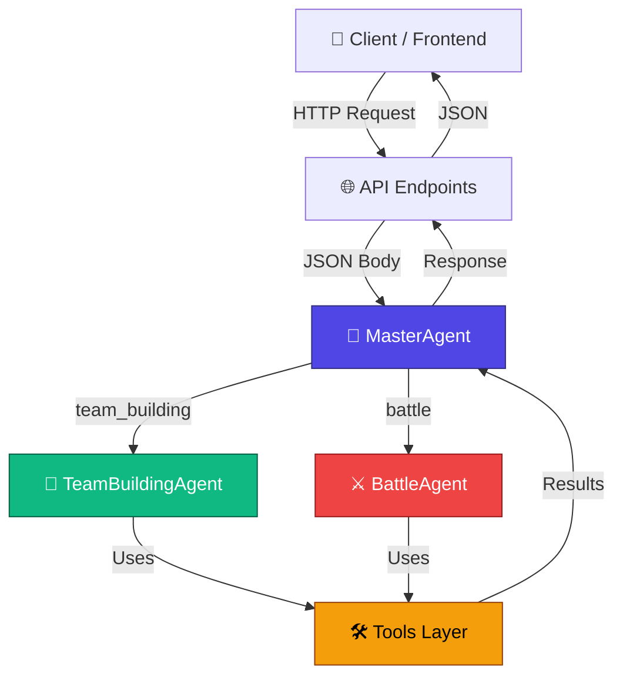
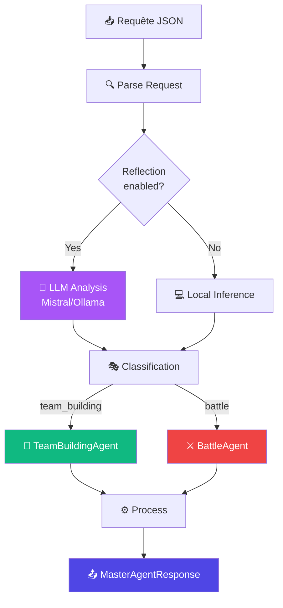
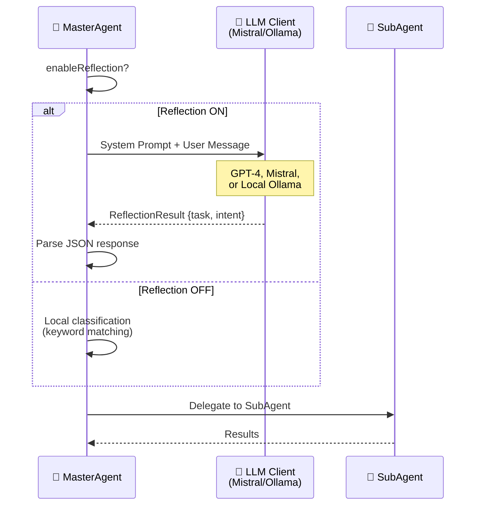
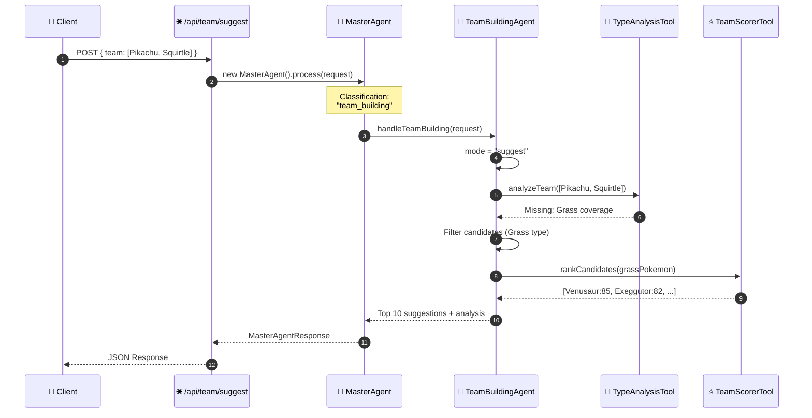
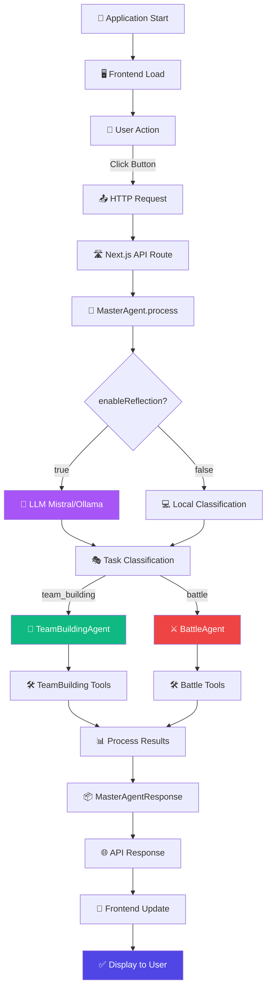

# 🏗️ Architecture Complète - Flux de Données

> Vue d'ensemble du système multi-agent avec diagrammes et flux détaillés

## 📋 Table des matières

- [🌐 Vue d'ensemble](#vue-ensemble)
- [🔄 Flux de données](#flux-donnees)
- [🧩 Intégration LLM](#integration-llm)
- [📝 Exemple complet](#exemple-complet)
- [📂 Fichiers clés](#fichiers-cles)

---

## 🌐 Vue d'ensemble {#vue-ensemble}

<div align="center">



</div>

---

## 🔄 Flux de données détaillé {#flux-donnees}

### 📥 Entrée - Requête Client

<table>
<tr>
<td width="50%">

**🔧 TeamBuilding Request**

```typescript
POST /api/team/suggest

{
  "team": [
    { "id": 25, "name": "Pikachu" },
    { "id": 7, "name": "Squirtle" }
  ],
  "mode": "suggest"
}
```

</td>
<td width="50%">

**⚔️ Battle Request**

```typescript
POST /api/battle/ai-action

{
  "state": {
    "playerTeam": [...],
    "opponentTeam": [...],
    "turn": 3,
    "weather": "none"
  },
  "side": "player"
}
```

</td>
</tr>
</table>

---

### 🎯 Traitement par MasterAgent



---

### 🛠️ Couche Tools - Utilitaires Métier

<table>
<tr>
<td width="50%">

#### 🔧 TeamBuilding Tools

| Tool | Location | Fonction |
|------|----------|----------|
| 🎨 **TypeAnalysisTool** | `tools/` | Analyse couverture de types |
| 🎭 **RoleClassifierTool** | `tools/` | Classification des rôles |
| 🤝 **SynergyTool** | `tools/` | Analyse synergies d'équipe |
| ⭐ **TeamScorerTool** | `tools/` | Scoring agrégé |

</td>
<td width="50%">

#### ⚔️ Battle Tools

| Tool | Location | Fonction |
|------|----------|----------|
| 🎯 **BattleDecisionTool** | `battleEngine/tools/` | Décision principale |
| 💥 **DamageCalculatorTool** | `battleEngine/tools/` | Formule de dégâts |
| ⚡ **SpeedComparatorTool** | `battleEngine/tools/` | Ordre de tour |
| 🤒 **StatusEffectTool** | `battleEngine/tools/` | Gestion des statuts |
| 📈 **StatModifierTool** | `battleEngine/tools/` | Stages de stats |

</td>
</tr>
</table>

---

### 📤 Sortie - Réponse Structurée

```typescript
// TeamBuilding Response
{
  "success": true,
  "task": "team_building",
  "teamBuildingResponse": {
    "suggestions": [
      { "pokemon": "Venusaur", "score": 85, "reasons": [...] },
      { "pokemon": "Exeggutor", "score": 82, "reasons": [...] }
    ],
    "analysis": {
      "strengths": ["Good type coverage", "Balanced roles"],
      "weaknesses": ["Weak to Ground"],
      "grade": "B+"
    }
  }
}

// Battle Response
{
  "success": true,
  "task": "battle",
  "battleResponse": {
    "action": {
      "type": "attack",
      "moveIndex": 0,
      "moveName": "Thunderbolt"
    },
    "reasoning": "Super effective + 98% KO chance",
    "expectedDamage": { "min": 118, "max": 145 },
    "winProbability": 0.65
  }
}
```

---

## 🧩 Intégration LLM {#integration-llm}

### 🎯 MasterAgent Réflexion (Optionnelle)



### ⚙️ Configuration LLM

```typescript
// lib/agents/MasterAgent.ts
export class MasterAgent {
  private llmClient: LLMChatClient;

  constructor(config?: {
    enableReflection?: boolean;
    llmConfig?: LLMConfig;
  }) {
    if (config?.llmConfig) {
      this.llmClient = new LLMChatClient(config.llmConfig);
    } else {
      // Fallback: Ollama local ou Mistral
      this.llmClient = this.createDefaultLLMClient();
    }
  }

  private createDefaultLLMClient(): LLMChatClient {
    return new LLMChatClient({
      provider: process.env.LLM_PROVIDER || 'ollama',
      model: process.env.LLM_MODEL || 'mistral',
      apiKey: process.env.MISTRAL_API_KEY,
      baseURL: process.env.OLLAMA_URL || 'http://localhost:11434'
    });
  }
}
```

---

## 📝 Exemple complet {#exemple-complet}

### 🎬 Scénario: "Suggère-moi un 3ème Pokémon"



**📊 Timeline:**

1. **Client** envoie requête HTTP POST
2. **API Route** crée MasterAgent instance
3. **MasterAgent** classifie → `team_building`
4. **TeamBuildingAgent** détecte mode `suggest`
5. **TypeAnalysisTool** identifie manques
6. **Filtrage** des candidats appropriés
7. **TeamScorerTool** classe par score
8. **Retour** des résultats au client

---

## 📂 Fichiers clés {#fichiers-cles}

### 🗂️ Structure du Projet

```
lib/
├── agents/
│   ├── MasterAgent.ts                    # 🤖 Orchestrateur principal
│   ├── types.ts                          # Types TypeScript
│   │
│   ├── subAgents/
│   │   ├── TeamBuildingAgent.ts          # 🔧 Expert équipes
│   │   └── BattleAgent.ts                # ⚔️ Expert combat
│   │
│   ├── tools/                            # 🔧 TeamBuilding Tools
│   │   ├── TypeAnalysisTool.ts
│   │   ├── RoleClassifierTool.ts
│   │   ├── SynergyTool.ts
│   │   └── TeamScorerTool.ts
│   │
│   └── battleEngine/
│       ├── tools/                        # ⚔️ Battle Tools
│       │   ├── BattleDecisionTool.ts
│       │   ├── DamageCalculatorTool.ts
│       │   ├── SpeedComparatorTool.ts
│       │   ├── StatusEffectTool.ts
│       │   └── StatModifierTool.ts
│       │
│       └── BattleEngine.ts               # Moteur de combat
│
├── llm/
│   ├── LLMChatClient.ts                  # Client LLM universel
│   └── providers/
│       ├── mistral.ts
│       └── ollama.ts
│
└── types/
    ├── pokemon.ts                         # Types Pokémon
    ├── battle.ts                          # Types Battle
    └── agent.ts                           # Types Agent

app/
├── api/
│   ├── team/
│   │   ├── suggest/route.ts              # POST suggestions
│   │   ├── analyze/route.ts              # POST analyse
│   │   └── counter/route.ts              # POST counter
│   │
│   └── battle/
│       ├── ai-action/route.ts            # POST décision IA
│       └── simulate/route.ts             # POST simulation
│
└── tournament/page.tsx                    # UI Tournoi

data/
├── pokemon-cache/                         # Cache JSON (640+ Pokémon)
│   ├── 1.json                            # Bulbasaur
│   ├── 2.json                            # Ivysaur
│   └── ...
│
└── site-settings.json                     # Config globale
```

---

### 📄 Fichiers Principaux

<table>
<tr>
<th>Fichier</th>
<th>Rôle</th>
<th>Lignes</th>
</tr>
<tr>
<td>

`MasterAgent.ts`

</td>
<td>

🤖 **Orchestrateur**
- Classification des tâches
- Réflexion LLM (optionnelle)
- Délégation aux SubAgents
- Agrégation des résultats

</td>
<td align="center">~350</td>
</tr>
<tr>
<td>

`TeamBuildingAgent.ts`

</td>
<td>

🔧 **Expert Équipes**
- 4 modes: SUGGEST, ANALYZE, COUNTER, GENERATE
- Utilise TypeAnalysis, RoleClassifier, Synergy, TeamScorer
- Gestion pool de 640+ Pokémon

</td>
<td align="center">~800</td>
</tr>
<tr>
<td>

`BattleAgent.ts`

</td>
<td>

⚔️ **Expert Combat**
- Décisions de move optimales
- Switch strategy
- AutoBattle simulation
- Win probability calculation

</td>
<td align="center">~600</td>
</tr>
<tr>
<td>

`LLMChatClient.ts`

</td>
<td>

🧠 **Client LLM Universel**
- Abstraction Mistral/Ollama/OpenAI
- Gestion des prompts
- Parsing des réponses
- Retry logic & error handling

</td>
<td align="center">~250</td>
</tr>
</table>

---

### 🔌 API Endpoints

| Endpoint | Méthode | Agent | Description |
|----------|---------|-------|-------------|
| `/api/team/suggest` | POST | TeamBuilding | Suggère des Pokémon |
| `/api/team/analyze` | POST | TeamBuilding | Analyse une équipe |
| `/api/team/counter` | POST | TeamBuilding | Counter équipe adverse |
| `/api/battle/ai-action` | POST | Battle | Décision IA en combat |
| `/api/battle/simulate` | POST | Battle | Simulation auto-battle |

---

## 🎯 Flow Complet - De A à Z



---

## 🏆 Conclusion

<div align="center">

**Architecture robuste et scalable:**

🎯 **Séparation des responsabilités** • 🧩 **Composants modulaires** • 🔄 **Facile à étendre** • 🧪 **Testable individuellement**

</div>

> Cette architecture multi-agent permet d'ajouter facilement de nouveaux SubAgents
> (ex: QuizAgent, TrainerAgent) sans modifier le MasterAgent ni les outils existants.

---

<div align="center">

🔗 **Voir aussi:**
[Documentation Agents](agent.md) • [Documentation Tools](tool.md) • [Multi-Agent Diagram](multi-agent-architecture.md)

</div>
