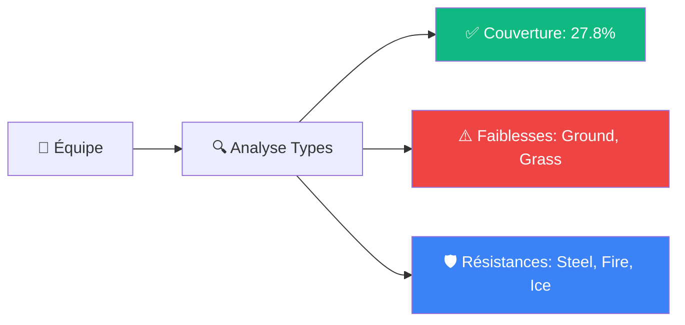
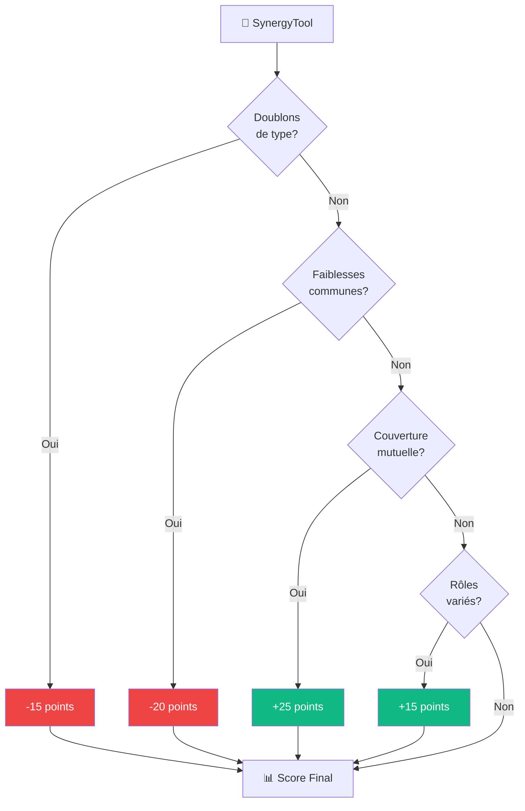
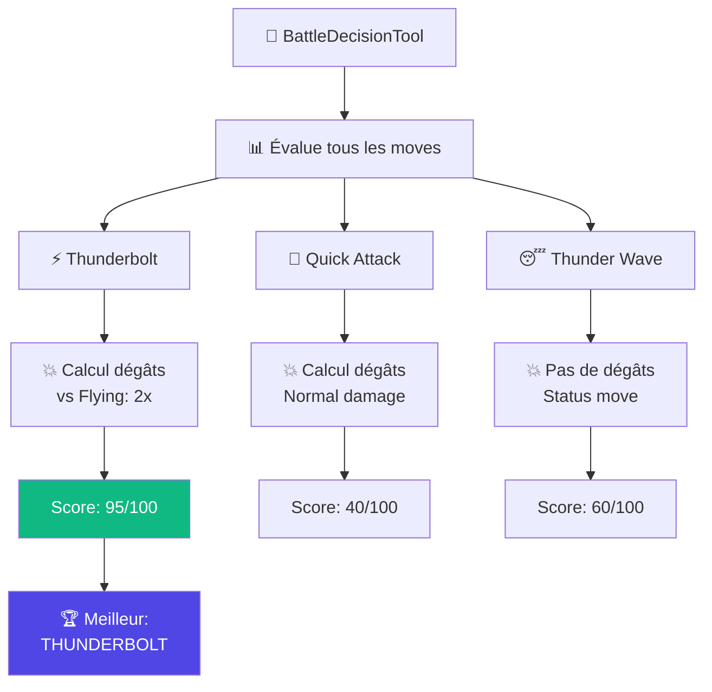
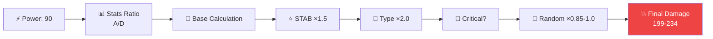
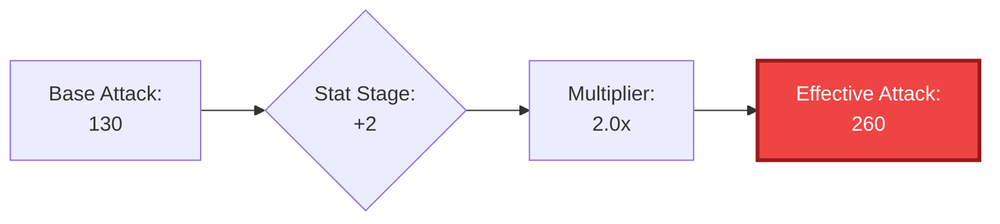
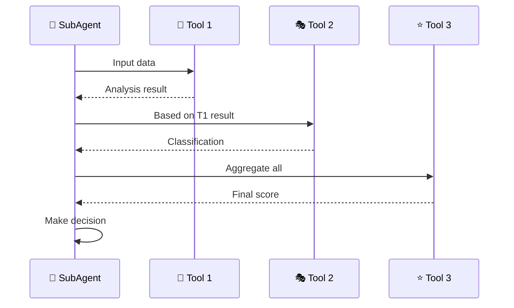

# 🛠️ Documentation des Tools - Guide Détaillé

> Explication complète de chaque outil utilisé par les agents

## 📋 Table des matières

### TeamBuilding Tools
- [🎨 TypeAnalysisTool](#type-analysis)
- [🎭 RoleClassifierTool](#role-classifier)
- [🤝 SynergyTool](#synergy)
- [⭐ TeamScorerTool](#team-scorer)

### Battle Tools
- [🎯 BattleDecisionTool](#battle-decision)
- [💥 DamageCalculatorTool](#damage-calculator)
- [⚡ SpeedComparatorTool](#speed-comparator)
- [🤒 StatusEffectTool](#status-effect)
- [📈 StatModifierTool](#stat-modifier)

---

## 🔧 TeamBuilding Tools

<div align="center">


</div>

---

### 🎨 TypeAnalysisTool {#type-analysis}

#### 📝 À quoi ça sert ?

Analyse les **types** d'une équipe Pokémon pour identifier :
- ✅ **Couverture offensive** (types que tu peux frapper efficacement)
- ⚠️ **Faiblesses défensives** (types dangereux contre ton équipe)
- 🛡️ **Résistances** (types contre lesquels tu es solide)

#### 🎯 Exemple Concret

**Input:**
```typescript
{
  team: [
    { name: "Pikachu", types: ["electric"] },
    { name: "Squirtle", types: ["water"] }
  ]
}
```

**Output:**
```typescript
{
  coverage: {
    strong: ["water", "flying", "fire", "ground", "rock"],  // 5 types couverts
    percentage: 27.8  // 5/18 types = 27.8%
  },
  weaknesses: {
    severe: ["ground", "grass"],        // Double faiblesse
    moderate: ["electric", "dark"]      // Faiblesse simple
  },
  resistances: {
    strong: ["steel", "fire", "ice"],
    immune: []
  }
}
```

#### 🎭 Analogie

> **C'est comme le jeu Pierre-Papier-Ciseaux étendu:**
> 
> - 🪨 Pierre écrase Ciseaux ✂️
> - ✂️ Ciseaux coupe Papier 📄
> - 📄 Papier couvre Pierre 🪨
> 
> Le Tool dit: _"Tu as Pierre et Papier, donc il te manque Ciseaux !"_

#### 📊 Visualisation



---

### 🎭 RoleClassifierTool {#role-classifier}

#### 📝 À quoi ça sert ?

Classifie chaque Pokémon selon son **rôle tactique** dans l'équipe :

| Rôle | Stats Clés | Fonction |
|------|-----------|----------|
| 💨 **Sweeper** | Speed + Attack/SpAtk | Finir les ennemis rapidement |
| 🛡️ **Wall** | Defense/SpDef + HP | Bloquer et encaisser |
| 🏰 **Tank** | HP + Defense | Absorber les dégâts |
| 🔄 **Pivot** | Speed + SpAtk | Switcher intelligemment |
| 💊 **Support** | Movepool utility | Booster l'équipe |

#### 🎯 Exemple Concret

**Input:**
```typescript
{
  pokemon: "Alakazam",
  stats: {
    hp: 55,
    attack: 50,
    defense: 45,
    spAtk: 135,  // 🔥 Très élevé
    spDef: 95,
    speed: 120   // ⚡ Très rapide
  }
}
```

**Output:**
```typescript
{
  role: "sweeper",
  confidence: 0.95,
  reasoning: "High Speed (120) + High SpAtk (135) = Perfect Sweeper"
}
```

**Contre-exemple - Blissey:**
```typescript
{
  pokemon: "Blissey",
  stats: {
    hp: 255,      // 🏆 Énorme !
    spDef: 135,   // 🛡️ Excellent
    speed: 55,
    attack: 10
  }
}
// → Role: "wall" (Special Defense Wall)
```

#### 🎭 Analogie

> **Équipe de football:**
> 
> - 💨 **Sweeper** = Attaquant rapide (Mbappé)
> - 🛡️ **Wall** = Défenseur solide (Van Dijk)
> - 🏰 **Tank** = Gardien de but (Donnarumma)
> - 🔄 **Pivot** = Milieu de terrain (De Bruyne)
> - 💊 **Support** = Entraîneur sur le terrain

---

### 🤝 SynergyTool {#synergy}

#### 📝 À quoi ça sert ?

Vérifie si les Pokémon **travaillent bien ensemble** :

- ✅ Couvrent mutuellement leurs faiblesses
- ✅ Ont des combos puissants
- ❌ Ne partagent PAS les mêmes faiblesses
- ❌ Pas de doublons de type inutiles

#### 🎯 Exemple Concret

<table>
<tr>
<td width="50%">

**✅ BONNE SYNERGIE**

```typescript
{
  team: [
    "Pikachu",  // Electric
    "Lapras"    // Water/Ice
  ]
}
```

**Analyse:**
- ✅ Pikachu frappe Flying/Water (super-efficace)
- ✅ Lapras couvre Ground (faiblesse de Pikachu)
- ✅ Diversité de types
- ✅ Pas de faiblesse commune critique

**Score:** 🟢 92/100

</td>
<td width="50%">

**❌ MAUVAISE SYNERGIE**

```typescript
{
  team: [
    "Pikachu",  // Electric
    "Zapdos"    // Electric/Flying
  ]
}
```

**Analyse:**
- ❌ Même type (Electric) = doublon
- ❌ Tous deux faibles à Ground
- ❌ Pas de diversité
- ❌ Facile à counter

**Score:** 🔴 45/100

</td>
</tr>
</table>

#### 🎭 Analogie

> **C'est comme les couleurs:**
> 
> - 🟦 **Bleu** + 🟧 **Orange** = Couleurs complémentaires (beau !)
> - 🟦 **Bleu** + 🟦 **Bleu** = Monotone (ennuyeux)

#### 📊 Calcul de Synergie



---

### ⭐ TeamScorerTool {#team-scorer}

#### 📝 À quoi ça sert ?

**Agrège tous les outils** pour donner un **score global** à l'équipe :

```
Score Final = TypeCoverage × 0.3 
            + RoleBalance × 0.25 
            + Synergy × 0.25 
            + StatTotal × 0.2
```

#### 🎯 Exemple Concret

**Input:**
```typescript
{
  team: [
    "Pikachu",
    "Squirtle",
    "Venusaur",
    "Charizard",
    "Alakazam",
    "Machamp"
  ]
}
```

**Output:**
```typescript
{
  overall: 85,
  grade: "A",
  breakdown: {
    typeCoverage: 88,    // 15.8/18 types couverts
    roleBalance: 90,     // 2 sweepers, 2 walls, 1 pivot, 1 support
    synergy: 82,         // Bonne complémentarité
    statTotal: 80        // Stats moyennes solides
  },
  strengths: [
    "Excellent type coverage (88%)",
    "Balanced team roles",
    "No critical shared weaknesses"
  ],
  weaknesses: [
    "Slightly weak to Ground (2/6 weak)",
    "Low average Speed (75)"
  ],
  recommendations: [
    "Consider adding a faster Pokémon",
    "Replace one Ground-weak member"
  ]
}
```

#### 📊 Échelle de Grades

| Score | Grade | Qualité |
|-------|-------|---------|
| 90-100 | S | 🏆 Exceptionnel |
| 85-89 | A+ | ⭐ Excellent |
| 80-84 | A | ✅ Très bon |
| 75-79 | B+ | 👍 Bon |
| 70-74 | B | 😊 Correct |
| 65-69 | C+ | 😐 Passable |
| 60-64 | C | ⚠️ Faible |
| < 60 | F | ❌ À refaire |

---

## ⚔️ Battle Tools

<div align="center">


</div>

---

### 🎯 BattleDecisionTool {#battle-decision}

#### 📝 À quoi ça sert ?

**Outil principal** qui décide de l'action optimale en combat :

- 🎮 Quel move utiliser ?
- 🔄 Faut-il switch ?
- 💊 Utiliser un item ?

#### 🎯 Exemple Concret

**Situation:**
```typescript
{
  myPokemon: {
    name: "Pikachu",
    hp: 75,
    maxHp: 100,
    moves: [
      { name: "Thunderbolt", type: "electric", power: 90 },
      { name: "Quick Attack", type: "normal", power: 40 },
      { name: "Thunder Wave", type: "electric", power: 0 }
    ]
  },
  opponent: {
    name: "Dragonite",
    hp: 120,
    maxHp: 150,
    types: ["dragon", "flying"]
  }
}
```

**Processus de décision:**



**Output:**
```typescript
{
  decision: {
    action: "attack",
    moveIndex: 0,
    moveName: "Thunderbolt"
  },
  score: 95,
  reasoning: "Super effective (2x) + High damage (expected 118 HP)",
  alternatives: [
    { move: "Thunder Wave", score: 60, reason: "Paralyze for control" },
    { move: "Quick Attack", score: 40, reason: "Low damage" }
  ]
}
```

---

### 💥 DamageCalculatorTool {#damage-calculator}

#### 📝 À quoi ça sert ?

Calcule les **dégâts précis** d'une attaque avec la **formule officielle Pokémon** :

```
Damage = ((2 * Level / 5 + 2) * Power * A/D / 50 + 2) 
         × STAB × Type × Critical × Random × Other
```

#### 🎯 Exemple Concret

**Input:**
```typescript
{
  attacker: {
    name: "Pikachu",
    level: 50,
    attack: 55,      // Physical stat (pas utilisé ici)
    spAtk: 90,       // Special stat (utilisé)
    statStages: {
      spAtk: +1      // +50% boost
    }
  },
  defender: {
    name: "Dragonite",
    spDef: 100,
    types: ["dragon", "flying"]
  },
  move: {
    name: "Thunderbolt",
    type: "electric",
    power: 90,
    category: "special"
  },
  battlefield: {
    weather: "none",
    terrain: "none"
  }
}
```

**Calcul étape par étape:**

1. **Base damage:** `((2×50/5 + 2) × 90 × (90×1.5)/100 / 50 + 2)` = `≈78`
2. **STAB (Same Type Attack Bonus):** `78 × 1.5` = `117` _(Pikachu est Electric)_
3. **Type effectiveness:** `117 × 2.0` = `234` _(Super efficace contre Flying)_
4. **Random factor:** `234 × (0.85 à 1.00)` = **`199 - 234`**

**Output:**
```typescript
{
  damage: {
    min: 199,
    max: 234,
    average: 217
  },
  koChance: 0.98,  // 98% de KO (Dragonite a 120 HP)
  breakdown: {
    baseDamage: 78,
    stab: 1.5,
    typeEffectiveness: 2.0,
    critical: false,
    other: []
  }
}
```

#### 📊 Formule Visualisée



---

### ⚡ SpeedComparatorTool {#speed-comparator}

#### 📝 À quoi ça sert ?

Détermine **l'ordre d'attaque** en comparant les vitesses :

```
Effective Speed = Base Speed × Stage Multiplier × Status × Item × Ability
```

#### 🎯 Exemple Concret

**Situation:**
```typescript
{
  pokemon1: {
    name: "Pikachu",
    baseSpeed: 90,
    statStages: { speed: 0 },  // Neutral
    status: null
  },
  pokemon2: {
    name: "Dragonite",
    baseSpeed: 80,
    statStages: { speed: +1 }, // +50% boost
    status: null
  }
}
```

**Calcul:**
- Pikachu: `90 × 1.0` = **90**
- Dragonite: `80 × 1.5` = **120** ✅ Plus rapide !

**Output:**
```typescript
{
  firstAttacker: "Dragonite",
  order: ["Dragonite", "Pikachu"],
  speedDifference: 30,
  reasoning: "Dragonite has +1 Speed stage (+50%)"
}
```

#### 🎭 Analogie

> **Course de voitures:**
> 
> - 🏎️ Pikachu: Vitesse 90 km/h
> - 🏁 Dragonite: Vitesse 80 km/h, mais avec Nitro! (+50%) = 120 km/h
> 
> → Dragonite arrive en premier !

---

### 🤒 StatusEffectTool {#status-effect}

#### 📝 À quoi ça sert ?

Gère les **statuts** et leurs effets :

| Status | Effet | Durée |
|--------|-------|-------|
| 😴 **Sleep** | Cannot move (50% wake chance each turn) | 1-3 tours |
| 🥶 **Freeze** | Cannot move (20% thaw chance) | Permanent |
| ⚡ **Paralysis** | 25% chance fail move, Speed ÷2 | Permanent |
| 🔥 **Burn** | Attack ÷2, lose 1/16 HP/turn | Permanent |
| 🤢 **Poison** | Lose 1/8 HP/turn | Permanent |
| 😵 **Confusion** | 33% chance hit self | 1-4 tours |

#### 🎯 Exemple Concret

**Avant tour:**
```typescript
{
  pokemon: "Pikachu",
  status: "paralysis",
  hp: 80/100
}
```

**Checks:**
1. ⚡ **Paralysis Check:** `Math.random() < 0.25` → `false` ✅ Can move!
2. 🏃 **Speed Modifier:** `90 → 45` (÷2)

**Output:**
```typescript
{
  canMove: true,
  speedModifier: 0.5,
  damageThisTurn: 0,
  message: "Pikachu is paralyzed but can move this turn"
}
```

**Scénario Burn:**
```typescript
{
  pokemon: "Charizard",
  status: "burn",
  hp: 100/120
}
```

**Output:**
```typescript
{
  canMove: true,
  attackModifier: 0.5,        // Attack ÷2
  damageThisTurn: 7,          // 120/16 = 7.5 → 7
  message: "Charizard is hurt by its burn! (7 HP)"
}
```

---

### 📈 StatModifierTool {#stat-modifier}

#### 📝 À quoi ça sert ?

Gère les **stages de stats** (boosts/debuffs) :

```
Stage:  -6   -5   -4   -3   -2   -1    0   +1   +2   +3   +4   +5   +6
Multiplier: 0.25 0.28 0.33 0.40 0.50 0.66 1.0 1.5 2.0 2.5 3.0 3.5 4.0
```

####  Exemple Concret

**Scénario: Swords Dance**

```typescript
// Before
{
  pokemon: "Machamp",
  attack: 130,
  statStages: { attack: 0 }
}

// Action: Use Swords Dance (+2 Attack stages)
{
  statStages: { attack: +2 }
}

// Effect
effectiveAttack = 130 × 2.0 = 260 🔥🔥
```

**Calcul complet:**



---

## 🎓 Résumé Final

### 🔧 TeamBuilding Tools

| Tool | Mission | Output |
|------|---------|--------|
| 🎨 TypeAnalysisTool | Analyse types | Coverage, Weaknesses, Resistances |
| 🎭 RoleClassifierTool | Classifie rôles | Sweeper, Wall, Tank, Pivot, Support |
| 🤝 SynergyTool | Vérifie synergie | Score de complémentarité |
| ⭐ TeamScorerTool | Score global | Grade A-F + recommandations |

### ⚔️ Battle Tools

| Tool | Mission | Output |
|------|---------|--------|
| 🎯 BattleDecisionTool | Décision optimale | Meilleure action + score |
| 💥 DamageCalculatorTool | Calcul dégâts | Min/Max/Avg damage + KO % |
| ⚡ SpeedComparatorTool | Ordre d'attaque | Qui attaque en premier |
| 🤒 StatusEffectTool | Gestion statuts | Can move? Dégâts? Modifiers? |
| 📈 StatModifierTool | Stages de stats | Multiplicateurs effectifs |

---

## 🎯 Comment les Tools sont Utilisés



**Principe:** Les SubAgents **orchestrent** les Tools pour accomplir des tâches complexes.

---

<div align="center">

🔗 **Voir aussi:**
[Documentation Agents](agent.md) • [Architecture Complète](ok.md) • [Multi-Agent Diagram](multi-agent-architecture.md)

</div>
